# ACA Infrastructure Template Parameter Implementation Plan

> **For agentic workers:** REQUIRED SUB-SKILL: Use superpowers:subagent-driven-development (recommended) or superpowers:executing-plans to implement this plan task-by-task. Steps use checkbox (`- [ ]`) syntax for tracking.

**Goal:** Add `--UseAzureContainerInfra` to the WebProject .NET template, scaffolding Azure Container Apps infrastructure as an alternative to the existing `--UseAzureAppServiceInfra` flag.

**Architecture:** New files use a `.aca.` infix (e.g. `main.aca.bicep`) and are renamed to their canonical paths by the template engine when ACA is selected. Three condition modifiers in `template.json` gate which files are emitted. All `webprojectazureprefix` tokens and `WebProject` source names are substituted by the template engine at instantiation time.

**Tech Stack:** .NET template engine (dotnet new), Bicep, GitHub Actions, Azure Container Apps, Azure Container Registry, bash/PowerShell

---

## File Map

### New files (create)
| File | Purpose |
|---|---|
| `infra/modules/aca-app.bicep` | Container App resource definition |
| `infra/modules/aca-environment.bicep` | ACA Managed Environment + Log Analytics |
| `infra/modules/container-registry.bicep` | ACR + AcrPush/AcrPull role assignments |
| `infra/main.aca.bicep` | ACA-flavor entry point (renamed → `main.bicep`) |
| `infra/main.aca.bicepparam` | ACA default params (renamed → `main.bicepparam`) |
| `infra/deploy.aca.ps1` | ACA deploy script Windows (renamed → `deploy.ps1`) |
| `infra/deploy.aca.sh` | ACA deploy script Linux/macOS (renamed → `deploy.sh`) |
| `infra/bootstrap.ps1` | One-time ACA setup, Windows |
| `infra/bootstrap.sh` | One-time ACA setup, Linux/macOS |
| `infra/README.aca.md` | ACA architecture docs (renamed → `README.md`) |
| `config/sync-appconfig.aca.sh` | Config sync resolving store by env tag (renamed → `sync-appconfig.sh`) |
| `.github/workflows/deploy.aca.yml` | ACA deploy pipeline (renamed → `deploy.yml`) |
| `.github/workflows/pr.aca.yml` | ACA PR environment pipeline (renamed → `pr.yml`) |
| `.github/workflows/infra.yml` | Auto-deploys bicep on `infra/**` changes |
| `WebProject.Api/Dockerfile` | Multi-stage container image build |

### Modified files
| File | Change |
|---|---|
| `.template.config/template.json` | New parameter, rename mapping, updated condition modifiers |

---

## Task 1: Add ACA Bicep modules

**Files:**
- Create: `infra/modules/aca-app.bicep`
- Create: `infra/modules/aca-environment.bicep`
- Create: `infra/modules/container-registry.bicep`

- [ ] **Step 1: Create `infra/modules/aca-environment.bicep`**

```bicep
@description('Name of the ACA Managed Environment.')
param name string

@description('Azure region.')
param location string

@description('Resource tags.')
param tags object

@description('Name for the Log Analytics workspace. Defaults to log-<name>.')
param logAnalyticsWorkspaceName string = 'log-${name}'

resource logAnalytics 'Microsoft.OperationalInsights/workspaces@2022-10-01' = {
  name: logAnalyticsWorkspaceName
  location: location
  tags: tags
  properties: {
    sku: {
      name: 'PerGB2018'
    }
    retentionInDays: 30
  }
}

resource environment 'Microsoft.App/managedEnvironments@2024-03-01' = {
  name: name
  location: location
  tags: tags
  properties: {
    appLogsConfiguration: {
      destination: 'log-analytics'
      logAnalyticsConfiguration: {
        customerId: logAnalytics.properties.customerId
        sharedKey: logAnalytics.listKeys().primarySharedKey
      }
    }
  }
}

output environmentId string = environment.id
output environmentName string = environment.name
output logAnalyticsWorkspaceId string = logAnalytics.id
output logAnalyticsWorkspaceName string = logAnalytics.name
```

- [ ] **Step 2: Create `infra/modules/container-registry.bicep`**

```bicep
@description('Name of the Azure Container Registry (alphanumeric only, globally unique).')
param name string

@description('Azure region.')
param location string

@description('Resource tags.')
param tags object

@description('Principal ID of the managed identity to grant AcrPush and AcrPull.')
param managedIdentityPrincipalId string

// Built-in role: AcrPush
var acrPushRoleId = subscriptionResourceId('Microsoft.Authorization/roleDefinitions', '8311e382-0749-4cb8-b61a-304f252e45ec')
// Built-in role: AcrPull
var acrPullRoleId = subscriptionResourceId('Microsoft.Authorization/roleDefinitions', '7f951dda-4ed3-4680-a7ca-43fe172d538d')

resource registry 'Microsoft.ContainerRegistry/registries@2023-07-01' = {
  name: name
  location: location
  tags: tags
  sku: {
    name: 'Basic'
  }
  properties: {
    adminUserEnabled: false
    publicNetworkAccess: 'Enabled'
    zoneRedundancy: 'Disabled'
  }
}

resource acrPushAssignment 'Microsoft.Authorization/roleAssignments@2022-04-01' = {
  name: guid(registry.id, managedIdentityPrincipalId, acrPushRoleId)
  scope: registry
  properties: {
    roleDefinitionId: acrPushRoleId
    principalId: managedIdentityPrincipalId
    principalType: 'ServicePrincipal'
  }
}

resource acrPullAssignment 'Microsoft.Authorization/roleAssignments@2022-04-01' = {
  name: guid(registry.id, managedIdentityPrincipalId, acrPullRoleId)
  scope: registry
  properties: {
    roleDefinitionId: acrPullRoleId
    principalId: managedIdentityPrincipalId
    principalType: 'ServicePrincipal'
  }
}

output loginServer string = registry.properties.loginServer
output name string = registry.name
```

- [ ] **Step 3: Create `infra/modules/aca-app.bicep`**

```bicep
@description('Name of the Container App.')
param name string

@description('Azure region.')
param location string

@description('Resource tags.')
param tags object

@description('Resource ID of the ACA Managed Environment.')
param environmentId string

@description('Full image reference, e.g. crprefix.azurecr.io/api:abc123.')
param containerImage string

@description('Full resource ID of the user-assigned managed identity.')
param managedIdentityId string

@description('Client ID of the managed identity (for AZURE_CLIENT_ID env var).')
param managedIdentityClientId string

@description('ASPNETCORE_ENVIRONMENT value.')
param aspnetcoreEnvironment string

@description('App Configuration endpoint URL.')
param appConfigurationEndpoint string

@description('Key Vault URI for the SQL connection string secret (versionless).')
param sqlConnectionStringSecretUri string

@description('ACR login server, e.g. crprefix.azurecr.io. Used for managed-identity image pulls.')
param acrLoginServer string

@description('Initial CORS allowed origin (SWA URL). Can be empty string initially.')
param corsAllowedOrigins string = ''

@description('Minimum number of replicas.')
@minValue(0)
param minReplicas int = 0

@description('Maximum number of replicas.')
@minValue(1)
@maxValue(300)
param maxReplicas int = 3

@description('Revision mode: Single or Multiple.')
@allowed(['Single', 'Multiple'])
param revisionMode string = 'Single'

resource app 'Microsoft.App/containerApps@2024-03-01' = {
  name: name
  location: location
  tags: tags
  identity: {
    type: 'UserAssigned'
    userAssignedIdentities: {
      '${managedIdentityId}': {}
    }
  }
  properties: {
    environmentId: environmentId
    configuration: {
      activeRevisionsMode: revisionMode
      ingress: {
        external: true
        targetPort: 8080
        transport: 'http'
        allowInsecure: false
      }
      registries: [
        {
          server: acrLoginServer
          identity: managedIdentityId
        }
      ]
      secrets: [
        {
          name: 'sql-connection-string'
          keyVaultUrl: sqlConnectionStringSecretUri
          identity: managedIdentityId
        }
      ]
    }
    template: {
      containers: [
        {
          name: 'api'
          image: containerImage
          env: concat(
            [
              { name: 'ASPNETCORE_ENVIRONMENT', value: aspnetcoreEnvironment }
              { name: 'AZURE_CLIENT_ID', value: managedIdentityClientId }
              { name: 'AppConfiguration__Endpoint', value: appConfigurationEndpoint }
              { name: 'ConnectionStrings__DefaultConnection', secretRef: 'sql-connection-string' }
            ],
            corsAllowedOrigins != '' ? [{ name: 'Cors__AllowedOrigins', value: corsAllowedOrigins }] : []
          )
          probes: [
            {
              type: 'Readiness'
              httpGet: {
                path: '/health'
                port: 8080
                scheme: 'HTTP'
              }
              initialDelaySeconds: 5
              periodSeconds: 10
              failureThreshold: 6
            }
            {
              type: 'Liveness'
              httpGet: {
                path: '/alive'
                port: 8080
                scheme: 'HTTP'
              }
              initialDelaySeconds: 10
              periodSeconds: 30
              failureThreshold: 3
            }
          ]
          resources: {
            cpu: any(json('0.5'))
            memory: '1Gi'
          }
        }
      ]
      scale: {
        minReplicas: minReplicas
        maxReplicas: maxReplicas
      }
    }
  }
}

output fqdn string = app.properties.configuration.ingress.fqdn
output name string = app.name
```

- [ ] **Step 4: Commit**

```bash
git add infra/modules/aca-app.bicep infra/modules/aca-environment.bicep infra/modules/container-registry.bicep
git commit -m "feat(template): add ACA bicep modules (aca-app, aca-environment, container-registry)"
```

---

## Task 2: Add ACA main Bicep files

**Files:**
- Create: `infra/main.aca.bicep`
- Create: `infra/main.aca.bicepparam`

- [ ] **Step 1: Create `infra/main.aca.bicep`**

```bicep
targetScope = 'subscription'

@description('The Azure region to deploy resources into.')
param location string

@description('SQL Server administrator login name.')
param sqlAdminLogin string

@description('SQL Server administrator password.')
@secure()
param sqlAdminPassword string

@description('Azure region for the Static Web App. Must be one of the supported SWA regions (eastus2, westus2, centralus, westeurope, eastasia).')
param staticWebAppLocation string = 'eastus2'

@description('Container image for the prod Container App (preserved across infra re-runs).')
param prodContainerImage string = 'mcr.microsoft.com/azuredocs/containerapps-helloworld:latest'

@description('Container image for the staging Container App (preserved across infra re-runs).')
param stgContainerImage string = 'mcr.microsoft.com/azuredocs/containerapps-helloworld:latest'

// ---------------------------------------------------------------------------
// Derived values
// ---------------------------------------------------------------------------

var prefix = 'webprojectazureprefix'
var uniqueSuffix = uniqueString(rg.id)

var tags = {
  project: 'WebProject'
  managedBy: 'bicep'
}

// ---------------------------------------------------------------------------
// Resource group
// ---------------------------------------------------------------------------

resource rg 'Microsoft.Resources/resourceGroups@2024-03-01' = {
  name: 'rg-${prefix}'
  location: location
  tags: tags
}

// ---------------------------------------------------------------------------
// Shared resources
// ---------------------------------------------------------------------------

module identity 'modules/managed-identity.bicep' = {
  name: 'identity'
  scope: rg
  params: {
    name: 'id-${prefix}'
    location: location
    tags: tags
  }
}

module sqlServer 'modules/sql-server.bicep' = {
  name: 'sqlServer'
  scope: rg
  params: {
    name: 'sql-${prefix}'
    location: location
    tags: tags
    adminLogin: sqlAdminLogin
    adminPassword: sqlAdminPassword
  }
}

module sqlDbProd 'modules/sql-database.bicep' = {
  name: 'sqlDbProd'
  scope: rg
  params: {
    serverName: sqlServer.outputs.serverName
    databaseName: 'sqldb-${prefix}-prod'
    location: location
    tags: union(tags, { environment: 'production' })
  }
}

module sqlDbStg 'modules/sql-database.bicep' = {
  name: 'sqlDbStg'
  scope: rg
  params: {
    serverName: sqlServer.outputs.serverName
    databaseName: 'sqldb-${prefix}-stg'
    location: location
    tags: union(tags, { environment: 'staging' })
  }
}

// Two Key Vaults — prod secrets never touch staging/ephemeral environments
module kvProd 'modules/keyvault.bicep' = {
  name: 'kvProd'
  scope: rg
  params: {
    name: 'kv-${prefix}-prod-${take(uniqueSuffix, 11)}'
    location: location
    tags: union(tags, { environment: 'production' })
    managedIdentityPrincipalId: identity.outputs.principalId
    sqlConnectionString: 'Server=tcp:${sqlServer.outputs.serverFqdn},1433;Initial Catalog=${sqlDbProd.outputs.databaseName};User ID=${sqlAdminLogin};Password=${sqlAdminPassword};Encrypt=True;TrustServerCertificate=False;Connection Timeout=30;'
  }
}

module kvStg 'modules/keyvault.bicep' = {
  name: 'kvStg'
  scope: rg
  params: {
    name: 'kv-${prefix}-stg-${take(uniqueSuffix, 11)}'
    location: location
    tags: union(tags, { environment: 'staging' })
    managedIdentityPrincipalId: identity.outputs.principalId
    sqlConnectionString: 'Server=tcp:${sqlServer.outputs.serverFqdn},1433;Initial Catalog=${sqlDbStg.outputs.databaseName};User ID=${sqlAdminLogin};Password=${sqlAdminPassword};Encrypt=True;TrustServerCertificate=False;Connection Timeout=30;'
    allowSecretWrite: true  // CI/CD writes PR connection strings into the staging KV
  }
}

module storage 'modules/storage.bicep' = {
  name: 'storage'
  scope: rg
  params: {
    name: 'st${prefix}${uniqueSuffix}'
    location: location
    tags: tags
    managedIdentityPrincipalId: identity.outputs.principalId
  }
}

// Staging store — shared, staging, and PR labels (used by staging + all PR Container Apps)
module appConfiguration 'modules/app-configuration.bicep' = {
  name: 'appConfiguration'
  scope: rg
  params: {
    name: 'appconfig-${prefix}-${take(uniqueSuffix, 8)}'
    location: location
    tags: union(tags, { environment: 'staging' })
    managedIdentityPrincipalId: identity.outputs.principalId
  }
}

// Production store — production label only; isolated from staging CI writes
module appConfigurationProd 'modules/app-configuration.bicep' = {
  name: 'appConfigurationProd'
  scope: rg
  params: {
    name: 'appconfig-${prefix}-prod-${take(uniqueSuffix, 8)}'
    location: location
    tags: union(tags, { environment: 'production' })
    managedIdentityPrincipalId: identity.outputs.principalId
  }
}

module acr 'modules/container-registry.bicep' = {
  name: 'containerRegistry'
  scope: rg
  params: {
    name: 'cr${prefix}'
    location: location
    tags: tags
    managedIdentityPrincipalId: identity.outputs.principalId
  }
}

module acaEnvProd 'modules/aca-environment.bicep' = {
  name: 'acaEnvProd'
  scope: rg
  params: {
    name: 'env-${prefix}-prod'
    location: location
    tags: union(tags, { environment: 'production' })
  }
}

module acaEnvStg 'modules/aca-environment.bicep' = {
  name: 'acaEnvStg'
  scope: rg
  params: {
    name: 'env-${prefix}-stg'
    location: location
    tags: union(tags, { environment: 'staging' })
  }
}

module acaAppProd 'modules/aca-app.bicep' = {
  name: 'acaAppProd'
  scope: rg
  params: {
    name: 'app-${prefix}-api'
    location: location
    tags: union(tags, { environment: 'production' })
    environmentId: acaEnvProd.outputs.environmentId
    containerImage: prodContainerImage
    managedIdentityId: identity.outputs.resourceId
    managedIdentityClientId: identity.outputs.clientId
    aspnetcoreEnvironment: 'Production'
    appConfigurationEndpoint: appConfigurationProd.outputs.endpoint
    sqlConnectionStringSecretUri: kvProd.outputs.sqlConnectionStringSecretUri
    acrLoginServer: acr.outputs.loginServer
    minReplicas: 1
    revisionMode: 'Multiple'
  }
  dependsOn: [kvProd]
}

module acaAppStg 'modules/aca-app.bicep' = {
  name: 'acaAppStg'
  scope: rg
  params: {
    name: 'app-${prefix}-api-stg'
    location: location
    tags: union(tags, { environment: 'staging' })
    environmentId: acaEnvStg.outputs.environmentId
    containerImage: stgContainerImage
    managedIdentityId: identity.outputs.resourceId
    managedIdentityClientId: identity.outputs.clientId
    aspnetcoreEnvironment: 'Staging'
    appConfigurationEndpoint: appConfiguration.outputs.endpoint
    sqlConnectionStringSecretUri: kvStg.outputs.sqlConnectionStringSecretUri
    acrLoginServer: acr.outputs.loginServer
    minReplicas: 0
    revisionMode: 'Single'
  }
  dependsOn: [kvStg]
}

module staticWebApp 'modules/static-web-app.bicep' = {
  name: 'staticWebApp'
  scope: rg
  params: {
    name: 'swa-${prefix}'
    location: staticWebAppLocation
    tags: tags
  }
}

// ---------------------------------------------------------------------------
// Outputs
// ---------------------------------------------------------------------------

output resourceGroupName string = rg.name
output prodApiUrl string = 'https://${acaAppProd.outputs.fqdn}'
output stagingApiUrl string = 'https://${acaAppStg.outputs.fqdn}'
output acrLoginServer string = acr.outputs.loginServer
output webUrl string = 'https://${staticWebApp.outputs.defaultHostname}'
output staticWebAppName string = staticWebApp.outputs.name
output prodKeyVaultName string = kvProd.outputs.name
output stagingKeyVaultName string = kvStg.outputs.name
output prodAppConfigStoreName string = appConfigurationProd.outputs.name
output stagingAppConfigStoreName string = appConfiguration.outputs.name
output sqlServerFqdn string = sqlServer.outputs.serverFqdn
output managedIdentityClientId string = identity.outputs.clientId
```

- [ ] **Step 2: Create `infra/main.aca.bicepparam`**

```bicep
using './main.aca.bicep'

param location = 'centralus'

param staticWebAppLocation = 'centralus'

param sqlAdminLogin = 'sqladmin'

// sqlAdminPassword must be passed at deploy time:
//   ./infra/deploy.ps1
// or
//   ./infra/deploy.sh
// prodContainerImage and stgContainerImage are managed by infra.yml and bootstrap scripts.
```

- [ ] **Step 3: Commit**

```bash
git add infra/main.aca.bicep infra/main.aca.bicepparam
git commit -m "feat(template): add ACA main.aca.bicep with dual appconfig stores and container resources"
```

---

## Task 3: Add ACA deploy scripts

**Files:**
- Create: `infra/deploy.aca.ps1`
- Create: `infra/deploy.aca.sh`

- [ ] **Step 1: Create `infra/deploy.aca.ps1`**

```powershell
#!/usr/bin/env pwsh
<#
.SYNOPSIS
    Deploys all WebProject container infrastructure to Azure using a Deployment Stack.
    Creates/updates the stack-webprojectazureprefix deployment stack at subscription scope,
    which owns rg-webprojectazureprefix and all resources within it.
    Run from the repo root or the infra/ directory.

.PARAMETER Location
    Azure region. Defaults to 'centralus'.

.PARAMETER SqlAdminPassword
    SQL Server administrator password. Prompted securely if not provided.

.PARAMETER WhatIf
    Runs az stack sub validate instead of creating/updating the stack.

.EXAMPLE
    ./infra/deploy.ps1

.EXAMPLE
    ./infra/deploy.ps1 -WhatIf
#>

[CmdletBinding()]
param(
    [Parameter()]
    [string] $Location = 'centralus',

    [Parameter()]
    [securestring] $SqlAdminPassword,

    [Parameter()]
    [switch] $WhatIf
)

Set-StrictMode -Version Latest
$ErrorActionPreference = 'Stop'

function Debug-Log([string] $msg) {
    Write-Host "[DEBUG] $msg" -ForegroundColor DarkGray
}

Debug-Log "PowerShell version : $($PSVersionTable.PSVersion)"
Debug-Log "OS                 : $($PSVersionTable.OS)"
Debug-Log "CWD                : $(Get-Location)"

# Verify az is reachable
$azCmd = Get-Command az -ErrorAction SilentlyContinue
if (-not $azCmd) {
    Write-Error 'az CLI not found in PATH'
    exit 1
}
Debug-Log "az path            : $($azCmd.Source)"
Debug-Log "az version         :"
az version
Debug-Log "az bicep version   :"
az bicep version

# az.cmd is a batch file; calling it from a PS script goes through an extra
# cmd.exe layer that causes exit 255 on deployment commands. Call Python
# directly instead — PS handles .exe args reliably with no cmd.exe middleman.
$azDir     = Split-Path $azCmd.Source
$pythonExe = (Resolve-Path (Join-Path $azDir '..\python.exe')).Path
Debug-Log "Python path        : $pythonExe"

if (-not $SqlAdminPassword) {
    $SqlAdminPassword = Read-Host 'SQL admin password' -AsSecureString
}

$plainPassword = [Runtime.InteropServices.Marshal]::PtrToStringAuto(
    [Runtime.InteropServices.Marshal]::SecureStringToBSTR($SqlAdminPassword)
)

Debug-Log "Location           : $Location"
Debug-Log "WhatIf             : $WhatIf"

# Resolve the infra directory regardless of where the script is called from
$scriptDir = Split-Path $MyInvocation.MyCommand.Path
$bicepFile = (Resolve-Path (Join-Path $scriptDir 'main.bicep')).Path
$armFile   = [IO.Path]::ChangeExtension($bicepFile, '.compiled.json')

Debug-Log "main.bicep         : $bicepFile"
Debug-Log "modules/ exists    : $(Test-Path (Join-Path $scriptDir 'modules'))"

# Compile Bicep -> ARM JSON using the working az bicep path.
# az stack sub create invokes the Bicep compiler through a different internal
# lookup that fails on some systems; passing pre-compiled ARM JSON avoids it.
Debug-Log "Compiling          : $bicepFile"
az bicep build --file $bicepFile --outfile $armFile 2>&1
Debug-Log "az bicep build exit: $LASTEXITCODE"
if ($LASTEXITCODE -ne 0) {
    Write-Error 'Bicep compilation failed'
    exit 1
}
Debug-Log "Compiled to        : $armFile"

try {
    if ($WhatIf) {
        Write-Host 'Validating WebProject deployment stack...' -ForegroundColor Cyan

        & $pythonExe -IBm azure.cli stack sub validate `
            --name stack-webprojectazureprefix `
            --location $Location `
            --template-file $armFile `
            --parameters "location=$Location" "staticWebAppLocation=$Location" sqlAdminLogin=sqladmin "sqlAdminPassword=$plainPassword" `
            --deny-settings-mode none `
            --output table
    }
    else {
        Write-Host 'Deploying WebProject container infrastructure...' -ForegroundColor Cyan

        & $pythonExe -IBm azure.cli stack sub create `
            --name stack-webprojectazureprefix `
            --location $Location `
            --template-file $armFile `
            --parameters "location=$Location" "staticWebAppLocation=$Location" sqlAdminLogin=sqladmin "sqlAdminPassword=$plainPassword" `
            --deny-settings-mode none `
            --action-on-unmanage deleteAll `
            --yes `
            --output table
    }
}
finally {
    Remove-Item $armFile -ErrorAction SilentlyContinue
    Debug-Log "Cleaned up         : $armFile"
}

Debug-Log "Exit code          : $LASTEXITCODE"

if ($LASTEXITCODE -ne 0) {
    Write-Error "Deployment failed with exit code $LASTEXITCODE"
    exit $LASTEXITCODE
}

Write-Host 'Deployment complete.' -ForegroundColor Green
```

- [ ] **Step 2: Create `infra/deploy.aca.sh`**

```bash
#!/usr/bin/env bash
# Deploys all WebProject container infrastructure to Azure using a Deployment Stack.
# Creates/updates the stack-webprojectazureprefix deployment stack at subscription scope,
# which owns rg-webprojectazureprefix and all resources within it.
#
# Usage:
#   ./infra/deploy.sh [--location <region>] [--what-if]
#
# Options:
#   --location <region>   Azure region (default: centralus)
#   --what-if             Validate the deployment without making changes
#
# The SQL admin password is read from the AZURE_SQL_ADMIN_PASSWORD environment
# variable if set, otherwise prompted interactively.
#
# Prerequisites:
#   - az CLI installed and logged in (az login)
#   - Bicep extension: az bicep install

set -euo pipefail

SCRIPT_DIR="$(cd "$(dirname "${BASH_SOURCE[0]}")" && pwd)"
LOCATION="centralus"
WHAT_IF=false

# Parse arguments
while [[ $# -gt 0 ]]; do
  case "$1" in
    --location) LOCATION="$2"; shift 2 ;;
    --what-if)  WHAT_IF=true; shift ;;
    *) echo "Unknown argument: $1"; exit 1 ;;
  esac
done

# Verify az CLI
if ! command -v az &>/dev/null; then
  echo "ERROR: az CLI not found in PATH" >&2
  exit 1
fi

echo "[DEBUG] az version:"
az version

echo "[DEBUG] az bicep version:"
az bicep version

echo "[DEBUG] Location      : $LOCATION"
echo "[DEBUG] WhatIf        : $WHAT_IF"
echo "[DEBUG] Script dir    : $SCRIPT_DIR"

# Resolve paths
BICEP_FILE="$SCRIPT_DIR/main.bicep"
ARM_FILE="${BICEP_FILE%.bicep}.compiled.json"

if [[ ! -f "$BICEP_FILE" ]]; then
  echo "ERROR: main.bicep not found at $BICEP_FILE" >&2
  exit 1
fi

# Get SQL admin password
if [[ -n "${AZURE_SQL_ADMIN_PASSWORD:-}" ]]; then
  SQL_ADMIN_PASSWORD="$AZURE_SQL_ADMIN_PASSWORD"
else
  read -r -s -p "SQL admin password: " SQL_ADMIN_PASSWORD
  echo
fi

# Compile Bicep -> ARM JSON
echo "[DEBUG] Compiling: $BICEP_FILE"
az bicep build --file "$BICEP_FILE" --outfile "$ARM_FILE"
echo "[DEBUG] Compiled to: $ARM_FILE"

# Cleanup ARM file on exit
trap 'rm -f "$ARM_FILE"; echo "[DEBUG] Cleaned up: $ARM_FILE"' EXIT

STACK_NAME="stack-webprojectazureprefix"
PARAMS=(
  "location=$LOCATION"
  "staticWebAppLocation=$LOCATION"
  "sqlAdminLogin=sqladmin"
  "sqlAdminPassword=$SQL_ADMIN_PASSWORD"
)

if [[ "$WHAT_IF" == "true" ]]; then
  echo "Validating WebProject deployment stack..."
  az deployment-stacks sub validate \
    --name "$STACK_NAME" \
    --location "$LOCATION" \
    --template-file "$ARM_FILE" \
    --parameters "${PARAMS[@]}" \
    --deny-settings-mode none \
    --output table
else
  echo "Deploying WebProject container infrastructure..."
  az deployment-stacks sub create \
    --name "$STACK_NAME" \
    --location "$LOCATION" \
    --template-file "$ARM_FILE" \
    --parameters "${PARAMS[@]}" \
    --deny-settings-mode none \
    --action-on-unmanage deleteAll \
    --yes \
    --output table
fi

echo "Deployment complete."
```

- [ ] **Step 3: Commit**

```bash
git add infra/deploy.aca.ps1 infra/deploy.aca.sh
git commit -m "feat(template): add ACA deploy scripts (deploy.aca.ps1, deploy.aca.sh)"
```

---

## Task 4: Add ACA bootstrap scripts

**Files:**
- Create: `infra/bootstrap.ps1`
- Create: `infra/bootstrap.sh`

- [ ] **Step 1: Create `infra/bootstrap.ps1`**

```powershell
<#
.SYNOPSIS
    WebProject — One-time bootstrap for container-based infrastructure.

.DESCRIPTION
    Run this ONCE before the first CI/CD deployment. After this, infra.yml
    handles all infrastructure changes automatically.

.PARAMETER Location
    Azure region to deploy to (default: centralus).

.EXAMPLE
    .\infra\bootstrap.ps1
    .\infra\bootstrap.ps1 -Location westus2
#>
param(
    [string]$Location = 'centralus'
)

Set-StrictMode -Version Latest
$ErrorActionPreference = 'Stop'

$scriptDir = Split-Path -Parent $MyInvocation.MyCommand.Path

Write-Host "WebProject Bootstrap" -ForegroundColor Cyan
Write-Host "====================" -ForegroundColor Cyan
Write-Host "Location: $Location"
Write-Host ""

# ── Preflight checks ──────────────────────────────────────────────────────────

function Test-Command([string]$cmd) { $null -ne (Get-Command $cmd -ErrorAction SilentlyContinue) }

if (-not (Test-Command 'az')) {
    Write-Error "az CLI not found. Install from https://aka.ms/installazurecliwindows"
    exit 1
}
if (-not (Test-Command 'gh')) {
    Write-Error "gh CLI not found. Install from https://cli.github.com"
    exit 1
}

$accountCheck = az account show 2>&1
if ($LASTEXITCODE -ne 0) {
    Write-Error "Not logged in to Azure. Run: az login"
    exit 1
}

$authCheck = gh auth status 2>&1
if ($LASTEXITCODE -ne 0) {
    Write-Error "Not logged in to GitHub. Run: gh auth login"
    exit 1
}

Write-Host "✓ Preflight checks passed" -ForegroundColor Green
Write-Host ""

# ── SQL admin password ────────────────────────────────────────────────────────

if ($env:AZURE_SQL_ADMIN_PASSWORD) {
    $SqlAdminPassword = $env:AZURE_SQL_ADMIN_PASSWORD
    Write-Host "✓ SQL admin password read from AZURE_SQL_ADMIN_PASSWORD env var" -ForegroundColor Green
} else {
    $securePassword = Read-Host -Prompt "SQL admin password" -AsSecureString
    $SqlAdminPassword = [System.Runtime.InteropServices.Marshal]::PtrToStringAuto(
        [System.Runtime.InteropServices.Marshal]::SecureStringToBSTR($securePassword)
    )
}

# ── Set GitHub Actions secret ─────────────────────────────────────────────────

Write-Host "Setting AZURE_SQL_ADMIN_PASSWORD as a GitHub Actions secret..."
$SqlAdminPassword | gh secret set AZURE_SQL_ADMIN_PASSWORD
if ($LASTEXITCODE -ne 0) { Write-Error "Failed to set GitHub secret"; exit 1 }
Write-Host "✓ GitHub secret set" -ForegroundColor Green
Write-Host ""

# ── Register required resource providers ─────────────────────────────────────

Write-Host "Registering required Azure resource providers..."
az provider register -n Microsoft.App --wait
az provider register -n Microsoft.ContainerRegistry --wait
Write-Host "✓ Resource providers registered"
Write-Host ""

# ── Compile and deploy Bicep ──────────────────────────────────────────────────

$bicepFile = Join-Path $scriptDir 'main.bicep'
$armFile   = Join-Path $scriptDir 'main.compiled.json'

try {
    Write-Host "Compiling Bicep..."
    az bicep build --file $bicepFile --outfile $armFile
    if ($LASTEXITCODE -ne 0) { Write-Error "Bicep compilation failed"; exit 1 }
    Write-Host "✓ Compiled" -ForegroundColor Green
    Write-Host ""

    Write-Host "Deploying infrastructure stack (this takes ~5-10 minutes)..."
    az stack sub create `
        --name stack-webprojectazureprefix `
        --location $Location `
        --template-file $armFile `
        --parameters `
            location=$Location `
            staticWebAppLocation=$Location `
            sqlAdminLogin=sqladmin `
            "sqlAdminPassword=$SqlAdminPassword" `
        --deny-settings-mode none `
        --action-on-unmanage deleteAll `
        --yes `
        --output table

    if ($LASTEXITCODE -ne 0) { Write-Error "Infrastructure deployment failed"; exit 1 }
    Write-Host ""
    Write-Host "✓ Infrastructure deployed" -ForegroundColor Green
    Write-Host ""
} finally {
    if (Test-Path $armFile) { Remove-Item $armFile -Force }
}

# ── Next steps ────────────────────────────────────────────────────────────────

$repoName = gh repo view --json nameWithOwner -q .nameWithOwner

Write-Host "========================================" -ForegroundColor Cyan
Write-Host "Bootstrap complete!" -ForegroundColor Cyan
Write-Host "========================================" -ForegroundColor Cyan
Write-Host ""
Write-Host "Next steps:"
Write-Host "  1. Push a commit to main to trigger the first full deployment:"
Write-Host "     git commit --allow-empty -m 'chore: trigger first container deployment'"
Write-Host "     git push"
Write-Host ""
Write-Host "  2. Watch the pipeline at:"
Write-Host "     https://github.com/$repoName/actions"
Write-Host ""
Write-Host "  From now on, all infrastructure changes via PR to infra/** are deployed"
Write-Host "  automatically by infra.yml. All app deploys trigger via push to main."
```

- [ ] **Step 2: Create `infra/bootstrap.sh`**

```bash
#!/usr/bin/env bash
# WebProject — One-time bootstrap for container-based infrastructure.
#
# Run this ONCE before the first CI/CD deployment. After this, infra.yml
# handles all infrastructure changes automatically.
#
# Prerequisites:
#   - az CLI installed and logged in (az login) with Contributor on the subscription
#   - gh CLI installed and authenticated to the GitHub repo
#   - Bicep extension: az bicep install
#
# Usage:
#   ./infra/bootstrap.sh [--location <region>]

set -euo pipefail

SCRIPT_DIR="$(cd "$(dirname "${BASH_SOURCE[0]}")" && pwd)"
LOCATION="centralus"

while [[ $# -gt 0 ]]; do
  case "$1" in
    --location) LOCATION="$2"; shift 2 ;;
    *) echo "Unknown argument: $1"; exit 1 ;;
  esac
done

echo "WebProject Bootstrap"
echo "===================="
echo "Location: ${LOCATION}"
echo ""

# ── Preflight checks ──────────────────────────────────────────────────────────

if ! command -v az &>/dev/null; then
  echo "ERROR: az CLI not found. Install from https://aka.ms/installazurecliwindows" >&2
  exit 1
fi
if ! command -v gh &>/dev/null; then
  echo "ERROR: gh CLI not found. Install from https://cli.github.com" >&2
  exit 1
fi
if ! az account show &>/dev/null; then
  echo "ERROR: Not logged in to Azure. Run: az login" >&2
  exit 1
fi
if ! gh auth status &>/dev/null; then
  echo "ERROR: Not logged in to GitHub. Run: gh auth login" >&2
  exit 1
fi

echo "✓ Preflight checks passed"
echo ""

# ── SQL admin password ────────────────────────────────────────────────────────

if [[ -n "${AZURE_SQL_ADMIN_PASSWORD:-}" ]]; then
  SQL_ADMIN_PASSWORD="$AZURE_SQL_ADMIN_PASSWORD"
  echo "✓ SQL admin password read from AZURE_SQL_ADMIN_PASSWORD env var"
else
  read -r -s -p "SQL admin password: " SQL_ADMIN_PASSWORD
  echo
fi

# ── Set GitHub Actions secret ─────────────────────────────────────────────────

echo "Setting AZURE_SQL_ADMIN_PASSWORD as a GitHub Actions secret..."
echo "${SQL_ADMIN_PASSWORD}" | gh secret set AZURE_SQL_ADMIN_PASSWORD
echo "✓ GitHub secret set"
echo ""

# ── Register required resource providers ─────────────────────────────────────

echo "Registering required Azure resource providers..."
az provider register -n Microsoft.App --wait
az provider register -n Microsoft.ContainerRegistry --wait
echo "✓ Resource providers registered"
echo ""

# ── Compile and deploy Bicep ──────────────────────────────────────────────────

BICEP_FILE="${SCRIPT_DIR}/main.bicep"
ARM_FILE="${BICEP_FILE%.bicep}.compiled.json"
trap 'rm -f "$ARM_FILE"' EXIT

echo "Compiling Bicep..."
az bicep build --file "$BICEP_FILE" --outfile "$ARM_FILE"
echo "✓ Compiled"
echo ""

echo "Deploying infrastructure stack (this takes ~5-10 minutes)..."
az stack sub create \
  --name stack-webprojectazureprefix \
  --location "${LOCATION}" \
  --template-file "${ARM_FILE}" \
  --parameters \
    location="${LOCATION}" \
    staticWebAppLocation="${LOCATION}" \
    sqlAdminLogin=sqladmin \
    sqlAdminPassword="${SQL_ADMIN_PASSWORD}" \
  --deny-settings-mode none \
  --action-on-unmanage deleteAll \
  --yes \
  --output table

echo ""
echo "✓ Infrastructure deployed"
echo ""

# ── Next steps ────────────────────────────────────────────────────────────────

echo "========================================"
echo "Bootstrap complete!"
echo "========================================"
echo ""
echo "Next steps:"
echo "  1. Push a commit to main to trigger the first full deployment:"
echo "     git commit --allow-empty -m 'chore: trigger first container deployment'"
echo "     git push"
echo ""
echo "  2. Watch the pipeline at:"
echo "     https://github.com/$(gh repo view --json nameWithOwner -q .nameWithOwner)/actions"
echo ""
echo "  From now on, all infrastructure changes via PR to infra/** are deployed"
echo "  automatically by infra.yml. All app deploys trigger via push to main."
```

- [ ] **Step 3: Commit**

```bash
git add infra/bootstrap.ps1 infra/bootstrap.sh
git commit -m "feat(template): add ACA bootstrap scripts (register providers, deploy stack, set GitHub secret)"
```

---

## Task 5: Add ACA config sync script

**Files:**
- Create: `config/sync-appconfig.aca.sh`

- [ ] **Step 1: Create `config/sync-appconfig.aca.sh`**

The only difference from `config/sync-appconfig.sh` is at the top: instead of resolving the store as `[0]`, it resolves by the `environment` tag (`staging` vs `production`). This is required because the ACA flavor has two App Configuration stores.

```bash
#!/usr/bin/env bash
set -euo pipefail

RG="rg-webprojectazureprefix"

# Parse arguments
SCOPE=""
PR_LABEL=""
TEARDOWN=false

while [[ $# -gt 0 ]]; do
  case "$1" in
    --scope) SCOPE="$2"; shift 2 ;;
    --pr-label) PR_LABEL="$2"; shift 2 ;;
    --teardown) TEARDOWN=true; shift ;;
    *) echo "Unknown argument: $1"; exit 1 ;;
  esac
done

# Validate
if [[ -z "$SCOPE" ]]; then
  echo "Usage: $0 --scope <shared|staging|production|pr> [--pr-label <prN>] [--teardown]"
  exit 1
fi
if [[ "$SCOPE" == "pr" && -z "$PR_LABEL" ]]; then
  echo "Error: --pr-label is required when --scope is pr"
  exit 1
fi

# Ensure PyYAML is available (not guaranteed on all GitHub Actions runners)
python3 -m pip install --quiet pyyaml

# Resolve the App Configuration store by environment tag.
# Production scope uses the production-tagged store; all other scopes use the staging store.
# This keeps staging CI writes completely isolated from the production store.
if [[ "$SCOPE" == "production" ]]; then
  _ENV_TAG="production"
else
  _ENV_TAG="staging"
fi

STORE=$(az appconfig list -g "$RG" \
  --query "[?tags.environment=='${_ENV_TAG}'].name | [0]" -o tsv)
if [[ -z "$STORE" ]]; then
  echo "ERROR: No App Configuration store with tag environment='${_ENV_TAG}' found in resource group '${RG}'" >&2
  exit 1
fi
echo "Using App Configuration store: $STORE (environment=${_ENV_TAG})"

# ── Teardown ──────────────────────────────────────────────────────────────────
if [[ "$TEARDOWN" == "true" ]]; then
  if [[ "$SCOPE" != "pr" ]]; then
    echo "Error: --teardown is only valid with --scope pr"
    exit 1
  fi
  echo "Deleting all AppConfig entries with label '${PR_LABEL}'..."
  az appconfig kv delete \
    --name "$STORE" \
    --key "*" \
    --label "$PR_LABEL" \
    --yes \
    --output none
  az appconfig feature delete \
    --name "$STORE" \
    --feature "*" \
    --label "$PR_LABEL" \
    --yes \
    --output none 2>/dev/null || true
  echo "Teardown complete."
  exit 0
fi

# ── Helper: upsert regular config keys ───────────────────────────────────────
upsert_config_keys() {
  local section="$1"
  local label="$2"   # empty string means no label (shared scope)

  echo "Syncing config keys for section '${section}'..."

  local section_json
  section_json=$(python3 - <<'PYEOF'
import yaml, json, sys, os

section_name = os.environ['_SECTION']
config_path = os.environ.get('_CONFIG_PATH', 'config/appconfig.yaml')

with open(config_path) as f:
    data = yaml.safe_load(f)

section = data.get(section_name, {}) or {}
print(json.dumps(section))
PYEOF
)

  # Iterate each key in the section JSON
  python3 - <<PYEOF2
import json, sys, os, subprocess

section = json.loads(os.environ['_SECTION_JSON'])
label = os.environ.get('_LABEL', '')
store = os.environ['_STORE']
rg = os.environ['_RG']

for key, value in section.items():
    if isinstance(value, dict):
        # KeyVault reference
        secret_name = value.get('keyVaultSecret', '')
        vault_name = value.get('keyVaultName', '')

        if not vault_name:
            # Resolve vault by environment tag
            result = subprocess.run(
                ['az', 'keyvault', 'list', '-g', rg,
                 '--query', f"[?tags.environment=='{label}'].name",
                 '-o', 'tsv'],
                capture_output=True, text=True, check=True
            )
            vault_name = result.stdout.strip()
            if not vault_name or '\n' in vault_name:
                print(f"ERROR: Expected exactly one Key Vault with tag environment='{label}', got: {vault_name!r}", file=sys.stderr)
                sys.exit(1)

        uri = f"https://{vault_name}.vault.azure.net/secrets/{secret_name}"
        kv_value = json.dumps({'uri': uri})

        cmd = [
            'az', 'appconfig', 'kv', 'set',
            '--name', store,
            '--key', key,
            '--value', kv_value,
            '--content-type', 'application/vnd.microsoft.appconfig.keyvaultref+json;charset=utf-8',
            '--yes',
            '--output', 'none'
        ]
        if label:
            cmd += ['--label', label]
    else:
        # Plain string value
        cmd = [
            'az', 'appconfig', 'kv', 'set',
            '--name', store,
            '--key', key,
            '--value', str(value),
            '--yes',
            '--output', 'none'
        ]
        if label:
            cmd += ['--label', label]

    print(f"  Upserting key: {key}")
    subprocess.run(cmd, check=True)

print("Config keys synced.")
PYEOF2
}

# ── Helper: bootstrap feature flags ──────────────────────────────────────────
bootstrap_feature_flags() {
  local ff_scope="$1"   # which section to read enabled state from (shared/staging/production)
  local label="$2"      # label to write to AppConfig (empty = no label)

  echo "Bootstrapping feature flags for scope '${ff_scope}' with label '${label:-<none>}'..."

  python3 - <<PYEOF3
import yaml, json, sys, os, subprocess

ff_scope = os.environ['_FF_SCOPE']
label = os.environ.get('_LABEL', '')
store = os.environ['_STORE']
config_path = os.environ.get('_FF_CONFIG_PATH', 'config/featureflags.yaml')

with open(config_path) as f:
    flags = yaml.safe_load(f) or {}

for flag_id, flag_data in flags.items():
    scope_data = flag_data.get(ff_scope)
    if scope_data is None:
        # Flag does not have an entry for this scope — skip
        continue

    description = flag_data.get('description', '')
    enabled = bool(scope_data.get('enabled', False))
    enabled_str = 'true' if enabled else 'false'

    # Check if already exists
    check_cmd = [
        'az', 'appconfig', 'kv', 'show',
        '--name', store,
        '--key', f'.appconfig.featureflag/{flag_id}',
    ]
    if label:
        check_cmd += ['--label', label]

    result = subprocess.run(check_cmd, capture_output=True, text=True)

    if result.returncode == 0 and result.stdout.strip():
        print(f"  Feature flag '{flag_id}' already exists — skipping.")
        continue

    # Bootstrap it
    flag_json = json.dumps({
        'id': flag_id,
        'description': description,
        'enabled': enabled
    })

    set_cmd = [
        'az', 'appconfig', 'kv', 'set',
        '--name', store,
        '--key', f'.appconfig.featureflag/{flag_id}',
        '--value', flag_json,
        '--content-type', 'application/vnd.microsoft.appconfig.ff+json;charset=utf-8',
        '--yes',
        '--output', 'none'
    ]
    if label:
        set_cmd += ['--label', label]

    print(f"  Bootstrapping feature flag: {flag_id} (enabled={enabled_str})")
    subprocess.run(set_cmd, check=True)

print("Feature flags bootstrapped.")
PYEOF3
}

# ── Helper: bump Sentinel ─────────────────────────────────────────────────────
bump_sentinel() {
  echo "Bumping Sentinel..."
  az appconfig kv set \
    --name "$STORE" \
    --key "Sentinel" \
    --value "$(date -u +%Y%m%dT%H%M%SZ)" \
    --yes \
    --output none
  echo "Sentinel bumped."
}

# ── Main dispatch ─────────────────────────────────────────────────────────────
case "$SCOPE" in
  shared)
    export _SECTION="shared"
    export _SECTION_JSON
    _SECTION_JSON=$(python3 -c "
import yaml, json
with open('config/appconfig.yaml') as f:
    data = yaml.safe_load(f)
print(json.dumps(data.get('shared', {}) or {}))
")
    export _LABEL=""
    export _STORE="$STORE"
    export _RG="$RG"
    export _FF_SCOPE="shared"
    export _FF_CONFIG_PATH="config/featureflags.yaml"

    upsert_config_keys "shared" ""
    bootstrap_feature_flags "shared" ""
    bump_sentinel
    ;;

  staging)
    export _SECTION="staging"
    export _SECTION_JSON
    _SECTION_JSON=$(python3 -c "
import yaml, json
with open('config/appconfig.yaml') as f:
    data = yaml.safe_load(f)
print(json.dumps(data.get('staging', {}) or {}))
")
    export _LABEL="staging"
    export _STORE="$STORE"
    export _RG="$RG"
    export _FF_SCOPE="staging"
    export _FF_CONFIG_PATH="config/featureflags.yaml"

    upsert_config_keys "staging" "staging"
    bootstrap_feature_flags "staging" "staging"
    bump_sentinel
    ;;

  production)
    export _SECTION="production"
    export _SECTION_JSON
    _SECTION_JSON=$(python3 -c "
import yaml, json
with open('config/appconfig.yaml') as f:
    data = yaml.safe_load(f)
print(json.dumps(data.get('production', {}) or {}))
")
    export _LABEL="production"
    export _STORE="$STORE"
    export _RG="$RG"
    export _FF_SCOPE="production"
    export _FF_CONFIG_PATH="config/featureflags.yaml"

    upsert_config_keys "production" "production"
    bootstrap_feature_flags "production" "production"
    # No Sentinel bump here — the Container App hasn't received the new image yet.
    # Production keys will be loaded naturally after the traffic shift on the first request.
    ;;

  pr)
    # Only bootstrap feature flags using staging enabled states, with PR label
    export _LABEL="$PR_LABEL"
    export _STORE="$STORE"
    export _RG="$RG"
    export _FF_SCOPE="staging"
    export _FF_CONFIG_PATH="config/featureflags.yaml"

    bootstrap_feature_flags "staging" "$PR_LABEL"
    # No Sentinel bump for PR scope
    ;;

  *)
    echo "Error: Unknown scope '${SCOPE}'. Must be one of: shared, staging, production, pr"
    exit 1
    ;;
esac

echo "Done."
```

- [ ] **Step 2: Commit**

```bash
git add config/sync-appconfig.aca.sh
git commit -m "feat(template): add ACA sync-appconfig.aca.sh with dual-store resolution by environment tag"
```

---

## Task 6: Add Dockerfile

**Files:**
- Create: `WebProject.Api/Dockerfile`

- [ ] **Step 1: Create `WebProject.Api/Dockerfile`**

The template engine substitutes `WebProject` → user's chosen project name throughout file contents.

```dockerfile
FROM mcr.microsoft.com/dotnet/sdk:10.0 AS build
WORKDIR /src
COPY . .
RUN dotnet restore WebProject.Api/WebProject.Api.csproj
RUN dotnet publish WebProject.Api/WebProject.Api.csproj \
    --configuration Release \
    --no-restore \
    --output /app/publish

FROM mcr.microsoft.com/dotnet/aspnet:10.0
WORKDIR /app
COPY --from=build /app/publish .
EXPOSE 8080
USER app
ENTRYPOINT ["dotnet", "WebProject.Api.dll"]
```

- [ ] **Step 2: Commit**

```bash
git add WebProject.Api/Dockerfile
git commit -m "feat(template): add Dockerfile for ACA container image builds"
```

---

## Task 7: Add ACA GitHub Actions workflows

**Files:**
- Create: `.github/workflows/deploy.aca.yml`
- Create: `.github/workflows/pr.aca.yml`
- Create: `.github/workflows/infra.yml`

- [ ] **Step 1: Create `.github/workflows/infra.yml`**

```yaml
name: Deploy Infrastructure

on:
  push:
    branches: [main]
    paths:
      - 'infra/**'
  workflow_dispatch:

permissions:
  id-token: write
  contents: read

jobs:
  deploy-infra:
    name: Deploy infrastructure stack
    runs-on: ubuntu-latest
    steps:
      - uses: actions/checkout@v4

      - uses: azure/login@v2
        with:
          client-id: ${{ secrets.AZURE_CLIENT_ID }}
          tenant-id: ${{ secrets.AZURE_TENANT_ID }}
          subscription-id: ${{ secrets.AZURE_SUBSCRIPTION_ID }}

      - name: Get current container images (preserve on re-runs)
        id: images
        run: |
          PROD_IMAGE=$(az containerapp show \
            --name app-webprojectazureprefix-api \
            --resource-group rg-webprojectazureprefix \
            --query "properties.template.containers[0].image" -o tsv 2>/dev/null \
            || echo "mcr.microsoft.com/azuredocs/containerapps-helloworld:latest")
          STG_IMAGE=$(az containerapp show \
            --name app-webprojectazureprefix-api-stg \
            --resource-group rg-webprojectazureprefix \
            --query "properties.template.containers[0].image" -o tsv 2>/dev/null \
            || echo "mcr.microsoft.com/azuredocs/containerapps-helloworld:latest")
          echo "prod=${PROD_IMAGE}" >> $GITHUB_OUTPUT
          echo "stg=${STG_IMAGE}" >> $GITHUB_OUTPUT

      - name: Compile Bicep
        run: az bicep build --file infra/main.bicep --outfile infra/main.compiled.json

      - name: Deploy infrastructure stack
        run: |
          az stack sub create \
            --name stack-webprojectazureprefix \
            --location centralus \
            --template-file infra/main.compiled.json \
            --parameters \
              location=centralus \
              staticWebAppLocation=centralus \
              sqlAdminLogin=sqladmin \
              sqlAdminPassword="${{ secrets.AZURE_SQL_ADMIN_PASSWORD }}" \
              prodContainerImage="${{ steps.images.outputs.prod }}" \
              stgContainerImage="${{ steps.images.outputs.stg }}" \
            --deny-settings-mode none \
            --action-on-unmanage deleteAll \
            --yes \
            --output table

      - name: Clean up compiled ARM file
        if: always()
        run: rm -f infra/main.compiled.json

      - name: Write job summary
        if: always()
        run: |
          if [ "${{ job.status }}" = "success" ]; then
            echo "## ✅ Deploy infrastructure" >> $GITHUB_STEP_SUMMARY
          else
            echo "## ❌ Deploy infrastructure failed" >> $GITHUB_STEP_SUMMARY
            echo "Check the Bicep compilation and deployment steps above." >> $GITHUB_STEP_SUMMARY
          fi
```

- [ ] **Step 2: Create `.github/workflows/deploy.aca.yml`**

```yaml
name: Deploy

on:
  push:
    branches: [main]

permissions:
  id-token: write
  contents: read

jobs:
  build:
    name: Build & test
    runs-on: ubuntu-latest
    outputs:
      sha: ${{ github.sha }}
      stg_url: ${{ steps.urls.outputs.stg_url }}
      prod_url: ${{ steps.urls.outputs.prod_url }}
    steps:
      - uses: actions/checkout@v4

      - uses: actions/setup-dotnet@v4
        with:
          dotnet-version: '10.x'

      - uses: actions/setup-node@v4
        with:
          node-version: '20'
          cache: npm
          cache-dependency-path: WebProject.Web/package-lock.json

      - name: Restore
        run: |
          for attempt in 1 2 3; do
            dotnet restore WebProject.slnx && break
            [ $attempt -lt 3 ] && { echo "Attempt $attempt/3 failed — retrying in 15s..."; sleep 15; } || exit 1
          done

      - name: Test
        run: |
          dotnet test WebProject.slnx \
            --configuration Release \
            --no-restore \
            --filter "FullyQualifiedName!~Integration"

      - name: Publish migration service
        run: |
          dotnet publish WebProject.MigrationService/WebProject.MigrationService.csproj \
            --configuration Release \
            --output publish/migration \
            --no-restore

      - uses: azure/login@v2
        with:
          client-id: ${{ secrets.AZURE_CLIENT_ID }}
          tenant-id: ${{ secrets.AZURE_TENANT_ID }}
          subscription-id: ${{ secrets.AZURE_SUBSCRIPTION_ID }}

      - name: Get API URLs from Container Apps
        id: urls
        run: |
          STG_FQDN=$(az containerapp show \
            --name app-webprojectazureprefix-api-stg --resource-group rg-webprojectazureprefix \
            --query "properties.configuration.ingress.fqdn" -o tsv)
          PROD_FQDN=$(az containerapp show \
            --name app-webprojectazureprefix-api --resource-group rg-webprojectazureprefix \
            --query "properties.configuration.ingress.fqdn" -o tsv)
          echo "stg_url=https://${STG_FQDN}" >> $GITHUB_OUTPUT
          echo "prod_url=https://${PROD_FQDN}" >> $GITHUB_OUTPUT
          echo "Staging API: https://${STG_FQDN}"
          echo "Prod API:    https://${PROD_FQDN}"

      - name: Build and push API image
        run: |
          az acr login --name crwebprojectazureprefix
          docker build \
            -f WebProject.Api/Dockerfile \
            -t crwebprojectazureprefix.azurecr.io/webproject-api:${{ github.sha }} \
            .
          docker push crwebprojectazureprefix.azurecr.io/webproject-api:${{ github.sha }}

      - name: Build frontend (staging)
        working-directory: WebProject.Web
        env:
          VITE_API_BASE_URL: ${{ steps.urls.outputs.stg_url }}
        run: |
          for attempt in 1 2 3; do
            npm ci && break
            [ $attempt -lt 3 ] && { echo "Attempt $attempt/3 failed — retrying in 15s..."; sleep 15; } || exit 1
          done
          npm run build

      - uses: actions/upload-artifact@v4
        with:
          name: web-staging
          path: WebProject.Web/dist/client

      - name: Build frontend (production)
        working-directory: WebProject.Web
        env:
          VITE_API_BASE_URL: ${{ steps.urls.outputs.prod_url }}
        run: |
          for attempt in 1 2 3; do
            npm ci && break
            [ $attempt -lt 3 ] && { echo "Attempt $attempt/3 failed — retrying in 15s..."; sleep 15; } || exit 1
          done
          npm run build

      - uses: actions/upload-artifact@v4
        with:
          name: migration
          path: publish/migration

      - uses: actions/upload-artifact@v4
        with:
          name: web-prod
          path: WebProject.Web/dist/client

  deploy-staging:
    name: Deploy to staging
    needs: build
    runs-on: ubuntu-latest
    steps:
      - uses: actions/checkout@v4

      - uses: actions/download-artifact@v4
        with:
          name: web-staging
          path: ./web

      - uses: azure/login@v2
        with:
          client-id: ${{ secrets.AZURE_CLIENT_ID }}
          tenant-id: ${{ secrets.AZURE_TENANT_ID }}
          subscription-id: ${{ secrets.AZURE_SUBSCRIPTION_ID }}

      - name: Sync shared + staging config to App Configuration
        run: |
          chmod +x config/sync-appconfig.sh
          for attempt in 1 2 3; do
            config/sync-appconfig.sh --scope shared && break
            [ $attempt -lt 3 ] && { echo "Attempt $attempt/3 failed — retrying in 15s..."; sleep 15; } || exit 1
          done
          for attempt in 1 2 3; do
            config/sync-appconfig.sh --scope staging && break
            [ $attempt -lt 3 ] && { echo "Attempt $attempt/3 failed — retrying in 15s..."; sleep 15; } || exit 1
          done

      - name: Deploy API → staging Container App
        run: |
          for attempt in 1 2 3; do
            az containerapp update \
              --name app-webprojectazureprefix-api-stg \
              --resource-group rg-webprojectazureprefix \
              --image crwebprojectazureprefix.azurecr.io/webproject-api:${{ github.sha }} \
              --output none && break
            [ $attempt -lt 3 ] && { echo "Attempt $attempt/3 failed — retrying in 15s..."; sleep 15; } || exit 1
          done

      - name: Get SWA deployment token
        run: |
          az_retry() {
            local n=1 max=5 delay=15
            until "$@"; do
              (( n++ >= max )) && { echo "ERROR: command failed after $((max)) attempts: $*" >&2; return 1; }
              echo "Attempt $((n-1))/$((max-1)) failed — retrying in ${delay}s..."
              sleep $delay
            done
          }
          TOKEN=$(az_retry az staticwebapp secrets list \
            --name swa-webprojectazureprefix --resource-group rg-webprojectazureprefix \
            --query properties.apiKey -o tsv)
          echo "::add-mask::${TOKEN}"
          echo "SWA_TOKEN=${TOKEN}" >> $GITHUB_ENV

      - name: Deploy frontend → SWA staging environment
        id: swa_deploy
        uses: azure/static-web-apps-deploy@v1
        with:
          azure_static_web_apps_api_token: ${{ env.SWA_TOKEN }}
          action: upload
          app_location: ./web
          skip_app_build: true
          deployment_environment: staging

      - name: Set CORS allowed origin on staging Container App
        run: |
          SWA_URL="${{ steps.swa_deploy.outputs.static_web_app_url }}"
          for attempt in 1 2 3; do
            az containerapp update \
              --name app-webprojectazureprefix-api-stg \
              --resource-group rg-webprojectazureprefix \
              --set-env-vars "Cors__AllowedOrigins=${SWA_URL}" \
              --output none && break
            [ $attempt -lt 3 ] && { echo "Attempt $attempt/3 failed — retrying in 15s..."; sleep 15; } || exit 1
          done

      - name: Write job summary
        if: always()
        run: |
          if [ "${{ job.status }}" = "success" ]; then
            echo "## ✅ Deploy to staging" >> $GITHUB_STEP_SUMMARY
          else
            echo "## ❌ Deploy to staging failed" >> $GITHUB_STEP_SUMMARY
            echo "Check the failed step above. Common causes:" >> $GITHUB_STEP_SUMMARY
            echo "- **ACA update failed**: transient Azure issue — re-run the job" >> $GITHUB_STEP_SUMMARY
            echo "- **AppConfig unavailable**: transient Azure outage — re-run the job" >> $GITHUB_STEP_SUMMARY
            echo "- **Key Vault throttled**: too many requests — re-run the job" >> $GITHUB_STEP_SUMMARY
          fi

  smoke-test:
    name: Smoke test staging
    needs: [build, deploy-staging]
    runs-on: ubuntu-latest
    steps:
      - name: Health check — API staging
        run: |
          # Staging scales to zero between deploys. Allow up to 5 minutes for
          # the cold start (container pull + .NET runtime init + app startup).
          HEALTH_URL="${{ needs.build.outputs.stg_url }}/health"
          echo "Health check URL: ${HEALTH_URL}"
          for i in {1..30}; do
            HTTP=$(curl -s -o /tmp/health_body.txt -w "%{http_code}" \
              "${HEALTH_URL}" || echo "000")
            echo "Attempt $i/30 — ${HEALTH_URL} → HTTP $HTTP"
            cat /tmp/health_body.txt 2>/dev/null || true
            echo ""
            if [ "$HTTP" = "200" ]; then
              echo "Health check passed"
              exit 0
            fi
            sleep 10
          done
          echo "Health check failed after 30 attempts (5 minutes) — URL: ${HEALTH_URL}"
          exit 1

  migrate-prod:
    name: Migrate production database
    needs: smoke-test
    runs-on: ubuntu-latest
    steps:
      - uses: actions/download-artifact@v4
        with:
          name: migration
          path: ./migration

      - uses: actions/setup-dotnet@v4
        with:
          dotnet-version: '10.x'

      - uses: azure/login@v2
        with:
          client-id: ${{ secrets.AZURE_CLIENT_ID }}
          tenant-id: ${{ secrets.AZURE_TENANT_ID }}
          subscription-id: ${{ secrets.AZURE_SUBSCRIPTION_ID }}

      - name: Run migrations against production database
        run: |
          az_retry() {
            local n=1 max=5 delay=15
            until "$@"; do
              (( n++ >= max )) && { echo "ERROR: command failed after $((max)) attempts: $*" >&2; return 1; }
              echo "Attempt $((n-1))/$((max-1)) failed — retrying in ${delay}s..."
              sleep $delay
            done
          }
          KV=$(az_retry az keyvault list -g rg-webprojectazureprefix \
            --query "[?tags.environment=='production'].name" -o tsv)
          CONN=$(az_retry az keyvault secret show \
            --vault-name "${KV}" --name sql-connection-string \
            --query value -o tsv)
          echo "::add-mask::${CONN}"
          ASPNETCORE_ENVIRONMENT=Production \
          ConnectionStrings__DefaultConnection="${CONN}" \
          dotnet ./migration/WebProject.MigrationService.dll

      - name: Write job summary
        if: always()
        run: |
          if [ "${{ job.status }}" = "success" ]; then
            echo "## ✅ Migrate production database" >> $GITHUB_STEP_SUMMARY
          else
            echo "## ❌ Migrate production database failed" >> $GITHUB_STEP_SUMMARY
            echo "Check the failed step above. Common causes:" >> $GITHUB_STEP_SUMMARY
            echo "- **Key Vault throttled**: too many requests — re-run the job" >> $GITHUB_STEP_SUMMARY
            echo "- **Migration failure**: check if migration is safe to re-run (EF migrations are idempotent)" >> $GITHUB_STEP_SUMMARY
          fi

  deploy-prod:
    name: Deploy to production
    needs: [build, migrate-prod]
    runs-on: ubuntu-latest
    steps:
      - uses: actions/checkout@v4

      - uses: actions/download-artifact@v4
        with:
          name: web-prod
          path: ./web

      - uses: azure/login@v2
        with:
          client-id: ${{ secrets.AZURE_CLIENT_ID }}
          tenant-id: ${{ secrets.AZURE_TENANT_ID }}
          subscription-id: ${{ secrets.AZURE_SUBSCRIPTION_ID }}

      - name: Sync production config to App Configuration
        run: |
          chmod +x config/sync-appconfig.sh
          for attempt in 1 2 3; do
            config/sync-appconfig.sh --scope production && break
            [ $attempt -lt 3 ] && { echo "Attempt $attempt/3 failed — retrying in 15s..."; sleep 15; } || exit 1
          done

      - name: Get production SWA URL
        id: swa_url
        run: |
          SWA_HOSTNAME=$(az staticwebapp show \
            --name swa-webprojectazureprefix --resource-group rg-webprojectazureprefix \
            --query defaultHostname -o tsv)
          echo "url=https://${SWA_HOSTNAME}" >> $GITHUB_OUTPUT

      - name: Pin traffic to current revision (pre-update)
        run: |
          # In multiple-revision mode, pin the current live revision so the new
          # revision starts at 0% traffic and doesn't immediately serve requests.
          CURRENT_REVISION=$(az containerapp show \
            --name app-webprojectazureprefix-api \
            --resource-group rg-webprojectazureprefix \
            --query "properties.latestRevisionName" -o tsv)
          echo "Pinning traffic to current revision: ${CURRENT_REVISION}"
          az containerapp ingress traffic set \
            --name app-webprojectazureprefix-api \
            --resource-group rg-webprojectazureprefix \
            --revision-weight "${CURRENT_REVISION}=100" \
            --output none
          echo "CURRENT_REVISION=${CURRENT_REVISION}" >> $GITHUB_ENV

      - name: Create new prod revision at 0% traffic
        run: |
          SHORT_SHA="${GITHUB_SHA:0:8}"
          az containerapp update \
            --name app-webprojectazureprefix-api \
            --resource-group rg-webprojectazureprefix \
            --image crwebprojectazureprefix.azurecr.io/webproject-api:${{ github.sha }} \
            --set-env-vars "Cors__AllowedOrigins=${{ steps.swa_url.outputs.url }}" \
            --revision-suffix "${SHORT_SHA}" \
            --output none
          echo "SHORT_SHA=${SHORT_SHA}" >> $GITHUB_ENV

      - name: Wait for new revision to reach Running state
        run: |
          REVISION="app-webprojectazureprefix-api--${SHORT_SHA}"
          for i in {1..24}; do
            STATUS=$(az containerapp revision show \
              --name app-webprojectazureprefix-api \
              --resource-group rg-webprojectazureprefix \
              --revision "${REVISION}" \
              --query "properties.runningState" -o tsv 2>/dev/null || echo "Unknown")
            echo "Attempt $i/24 — Revision ${REVISION} state: ${STATUS}"
            if [ "$STATUS" = "Running" ]; then
              echo "Revision is Running"
              exit 0
            fi
            [ $i -eq 24 ] && { echo "Timed out waiting for revision to reach Running state"; exit 1; }
            sleep 10
          done

      - name: Shift 100% traffic to new revision
        run: |
          az containerapp ingress traffic set \
            --name app-webprojectazureprefix-api \
            --resource-group rg-webprojectazureprefix \
            --revision-weight "app-webprojectazureprefix-api--${SHORT_SHA}=100" \
            --output none

      - name: Verify production health
        run: |
          HEALTH_URL="${{ needs.build.outputs.prod_url }}/health"
          echo "Health check URL: ${HEALTH_URL}"
          for i in {1..12}; do
            HTTP=$(curl -s -o /dev/null -w "%{http_code}" \
              "${HEALTH_URL}" || echo "000")
            echo "Attempt $i/12 — ${HEALTH_URL} → HTTP $HTTP"
            if [ "$HTTP" = "200" ]; then
              echo "Production is healthy"
              exit 0
            fi
            sleep 10
          done
          echo "Production health check failed after traffic shift — URL: ${HEALTH_URL}"
          exit 1

      - name: Deactivate old revisions
        if: success()
        run: |
          az containerapp revision list \
            --name app-webprojectazureprefix-api \
            --resource-group rg-webprojectazureprefix \
            --query "[?name!='app-webprojectazureprefix-api--${SHORT_SHA}' && properties.active==\`true\`].name" \
            -o tsv \
            | while read -r rev; do
                [ -z "$rev" ] && continue
                echo "Deactivating revision: $rev"
                az containerapp revision deactivate \
                  --name app-webprojectazureprefix-api \
                  --resource-group rg-webprojectazureprefix \
                  --revision "$rev" \
                  --output none
              done

      - name: Get SWA deployment token
        run: |
          az_retry() {
            local n=1 max=5 delay=15
            until "$@"; do
              (( n++ >= max )) && { echo "ERROR: command failed after $((max)) attempts: $*" >&2; return 1; }
              echo "Attempt $((n-1))/$((max-1)) failed — retrying in ${delay}s..."
              sleep $delay
            done
          }
          TOKEN=$(az_retry az staticwebapp secrets list \
            --name swa-webprojectazureprefix --resource-group rg-webprojectazureprefix \
            --query properties.apiKey -o tsv)
          echo "::add-mask::${TOKEN}"
          echo "SWA_TOKEN=${TOKEN}" >> $GITHUB_ENV

      - name: Deploy frontend → SWA production
        uses: azure/static-web-apps-deploy@v1
        with:
          azure_static_web_apps_api_token: ${{ env.SWA_TOKEN }}
          action: upload
          app_location: ./web
          skip_app_build: true

      - name: Write job summary
        if: always()
        run: |
          if [ "${{ job.status }}" = "success" ]; then
            echo "## ✅ Deploy to production" >> $GITHUB_STEP_SUMMARY
            echo "Revision: app-webprojectazureprefix-api--${SHORT_SHA}" >> $GITHUB_STEP_SUMMARY
          else
            echo "## ❌ Deploy to production failed" >> $GITHUB_STEP_SUMMARY
            echo "Check the failed step above. Common causes:" >> $GITHUB_STEP_SUMMARY
            echo "- **Revision not Running**: check ACA logs at https://portal.azure.com — look for container startup errors" >> $GITHUB_STEP_SUMMARY
            echo "- **Health check failed after traffic shift**: prod may be serving errors — check ACA console logs immediately" >> $GITHUB_STEP_SUMMARY
            echo "- **AppConfig unavailable**: transient Azure outage — re-run the job" >> $GITHUB_STEP_SUMMARY
          fi
```

- [ ] **Step 3: Create `.github/workflows/pr.aca.yml`**

```yaml
name: PR Environment

on:
  pull_request:
    types: [opened, synchronize, reopened, closed]

permissions:
  id-token: write
  contents: read
  pull-requests: write
  statuses: write

env:
  SLOT: pr${{ github.event.pull_request.number }}
  DB: sqldb-webprojectazureprefix-pr${{ github.event.pull_request.number }}
  APP_NAME: app-webprojectazureprefix-api-pr${{ github.event.pull_request.number }}

jobs:
  deploy:
    name: Deploy PR environment
    if: github.event.action != 'closed'
    runs-on: ubuntu-latest
    steps:
      - uses: actions/checkout@v4

      # ── Build ──────────────────────────────────────────────────────────────

      - uses: actions/setup-dotnet@v4
        with:
          dotnet-version: '10.x'

      - uses: actions/setup-node@v4
        with:
          node-version: '20'
          cache: npm
          cache-dependency-path: WebProject.Web/package-lock.json

      - name: Restore
        run: |
          for attempt in 1 2 3; do
            dotnet restore WebProject.slnx && break
            [ $attempt -lt 3 ] && { echo "Attempt $attempt/3 failed — retrying in 15s..."; sleep 15; } || exit 1
          done

      - name: Test
        run: |
          dotnet test WebProject.slnx \
            --configuration Release \
            --no-restore \
            --filter "FullyQualifiedName!~Integration"

      - name: Publish migration service
        run: |
          dotnet publish WebProject.MigrationService/WebProject.MigrationService.csproj \
            --configuration Release \
            --output publish/migration \
            --no-restore

      # ── Azure login ────────────────────────────────────────────────────────

      - uses: azure/login@v2
        with:
          client-id: ${{ secrets.AZURE_CLIENT_ID }}
          tenant-id: ${{ secrets.AZURE_TENANT_ID }}
          subscription-id: ${{ secrets.AZURE_SUBSCRIPTION_ID }}

      - name: Build and push PR image
        run: |
          az acr login --name crwebprojectazureprefix
          docker build \
            -f WebProject.Api/Dockerfile \
            -t crwebprojectazureprefix.azurecr.io/webproject-api:${{ env.SLOT }}-${{ github.sha }} \
            .
          docker push crwebprojectazureprefix.azurecr.io/webproject-api:${{ env.SLOT }}-${{ github.sha }}

      - name: Sync shared + staging config and bootstrap PR feature flags
        run: |
          chmod +x config/sync-appconfig.sh
          for attempt in 1 2 3; do
            config/sync-appconfig.sh --scope shared && break
            [ $attempt -lt 3 ] && { echo "Attempt $attempt/3 failed — retrying in 15s..."; sleep 15; } || exit 1
          done
          for attempt in 1 2 3; do
            config/sync-appconfig.sh --scope staging && break
            [ $attempt -lt 3 ] && { echo "Attempt $attempt/3 failed — retrying in 15s..."; sleep 15; } || exit 1
          done
          for attempt in 1 2 3; do
            config/sync-appconfig.sh --scope pr --pr-label ${{ env.SLOT }} && break
            [ $attempt -lt 3 ] && { echo "Attempt $attempt/3 failed — retrying in 15s..."; sleep 15; } || exit 1
          done

      # ── Provision PR database ──────────────────────────────────────────────

      - name: Create PR database
        run: |
          SQL_SERVER=$(az sql server list -g rg-webprojectazureprefix --query "[0].name" -o tsv)
          SQL_LOCATION=$(az sql server list -g rg-webprojectazureprefix --query "[0].location" -o tsv)
          az deployment group create \
            --resource-group rg-webprojectazureprefix \
            --template-file infra/modules/sql-database.bicep \
            --parameters \
                serverName="${SQL_SERVER}" \
                databaseName=${{ env.DB }} \
                location="${SQL_LOCATION}" \
                "tags={\"pr\":\"${{ github.event.pull_request.number }}\",\"managedBy\":\"bicep\"}" \
            --mode Incremental

      - name: Build and store PR connection string
        run: |
          az_retry() {
            local n=1 max=5 delay=15
            until "$@"; do
              (( n++ >= max )) && { echo "ERROR: command failed after $((max)) attempts: $*" >&2; return 1; }
              echo "Attempt $((n-1))/$((max-1)) failed — retrying in ${delay}s..."
              sleep $delay
            done
          }
          KV=$(az_retry az keyvault list -g rg-webprojectazureprefix \
            --query "[?tags.environment=='staging'].name" -o tsv)
          STG_CONN=$(az_retry az keyvault secret show \
            --vault-name "${KV}" --name sql-connection-string \
            --query value -o tsv)
          PR_CONN="${STG_CONN/sqldb-webprojectazureprefix-stg/${{ env.DB }}}"
          if [ "${PR_CONN}" = "${STG_CONN}" ]; then
            echo "ERROR: connection string substitution failed — 'sqldb-webprojectazureprefix-stg' not found in staging connection string"
            exit 1
          fi
          echo "::add-mask::${PR_CONN}"
          az_retry az keyvault secret set \
            --vault-name "${KV}" \
            --name "sql-connection-string-${{ env.SLOT }}" \
            --value "${PR_CONN}" \
            --output none
          KV_URI=$(az_retry az keyvault show --name "${KV}" --query properties.vaultUri -o tsv | sed 's|/$||')
          echo "KV=${KV}" >> $GITHUB_ENV
          echo "KV_URI=${KV_URI}" >> $GITHUB_ENV

      # ── Migrate PR database ────────────────────────────────────────────────

      - name: Run migrations against PR database
        run: |
          az_retry() {
            local n=1 max=5 delay=15
            until "$@"; do
              (( n++ >= max )) && { echo "ERROR: command failed after $((max)) attempts: $*" >&2; return 1; }
              echo "Attempt $((n-1))/$((max-1)) failed — retrying in ${delay}s..."
              sleep $delay
            done
          }
          PR_CONN=$(az_retry az keyvault secret show \
            --vault-name "${KV}" \
            --name "sql-connection-string-${{ env.SLOT }}" \
            --query value -o tsv)
          echo "::add-mask::${PR_CONN}"
          ASPNETCORE_ENVIRONMENT=Staging \
          ConnectionStrings__DefaultConnection="${PR_CONN}" \
          dotnet ./publish/migration/WebProject.MigrationService.dll

      # ── Provision PR Container App ─────────────────────────────────────────

      - name: Get managed identity details
        run: |
          MI_ID=$(az identity show -g rg-webprojectazureprefix --name id-webprojectazureprefix --query id -o tsv)
          MI_CLIENT_ID=$(az identity show -g rg-webprojectazureprefix --name id-webprojectazureprefix --query clientId -o tsv)
          APPCONFIG_ENDPOINT=$(az appconfig list -g rg-webprojectazureprefix \
            --query "[?tags.environment=='staging'].endpoint | [0]" -o tsv)
          echo "MI_ID=${MI_ID}" >> $GITHUB_ENV
          echo "MI_CLIENT_ID=${MI_CLIENT_ID}" >> $GITHUB_ENV
          echo "APPCONFIG_ENDPOINT=${APPCONFIG_ENDPOINT}" >> $GITHUB_ENV

      - name: Create or update PR Container App
        run: |
          PR_SECRET_URI="${KV_URI}/secrets/sql-connection-string-${{ env.SLOT }}"

          PROVISIONING_STATE=$(az containerapp show \
            --name ${{ env.APP_NAME }} \
            --resource-group rg-webprojectazureprefix \
            --query "properties.provisioningState" -o tsv 2>/dev/null || echo "NotFound")
          echo "Provisioning state: ${PROVISIONING_STATE}"

          if [ "${PROVISIONING_STATE}" = "Failed" ]; then
            echo "Container App is in Failed state — deleting before recreating"
            az containerapp delete \
              --name ${{ env.APP_NAME }} \
              --resource-group rg-webprojectazureprefix \
              --yes
            PROVISIONING_STATE="NotFound"
          fi

          if [ "${PROVISIONING_STATE}" != "NotFound" ]; then
            # Update existing (synchronize event)
            az containerapp registry set \
              --name ${{ env.APP_NAME }} \
              --resource-group rg-webprojectazureprefix \
              --server crwebprojectazureprefix.azurecr.io \
              --identity "${MI_ID}" \
              --output none
            az containerapp update \
              --name ${{ env.APP_NAME }} \
              --resource-group rg-webprojectazureprefix \
              --image crwebprojectazureprefix.azurecr.io/webproject-api:${{ env.SLOT }}-${{ github.sha }} \
              --output none
          else
            # Create new (opened/reopened/post-delete event)
            az containerapp create \
              --name ${{ env.APP_NAME }} \
              --resource-group rg-webprojectazureprefix \
              --environment env-webprojectazureprefix-stg \
              --image crwebprojectazureprefix.azurecr.io/webproject-api:${{ env.SLOT }}-${{ github.sha }} \
              --user-assigned "${MI_ID}" \
              --registry-server crwebprojectazureprefix.azurecr.io \
              --registry-identity "${MI_ID}" \
              --min-replicas 0 \
              --max-replicas 3 \
              --ingress external \
              --target-port 8080 \
              --secrets "sql-connection-string=keyvaultref:${PR_SECRET_URI},identityref:${MI_ID}" \
              --env-vars \
                "ASPNETCORE_ENVIRONMENT=Staging" \
                "AZURE_CLIENT_ID=${MI_CLIENT_ID}" \
                "AppConfiguration__Endpoint=${APPCONFIG_ENDPOINT}" \
                "ConnectionStrings__DefaultConnection=secretref:sql-connection-string" \
                "SLOT_NAME=${{ env.SLOT }}" \
              --output none
          fi

      - name: Get PR Container App FQDN
        id: pr_app
        run: |
          FQDN=$(az containerapp show \
            --name ${{ env.APP_NAME }} \
            --resource-group rg-webprojectazureprefix \
            --query "properties.configuration.ingress.fqdn" -o tsv)
          echo "fqdn=${FQDN}" >> $GITHUB_OUTPUT
          echo "url=https://${FQDN}" >> $GITHUB_OUTPUT

      # ── Build and deploy frontend ──────────────────────────────────────────

      - name: Build frontend for PR
        working-directory: WebProject.Web
        env:
          VITE_API_BASE_URL: ${{ steps.pr_app.outputs.url }}
        run: |
          for attempt in 1 2 3; do
            npm ci && break
            [ $attempt -lt 3 ] && { echo "Attempt $attempt/3 failed — retrying in 15s..."; sleep 15; } || exit 1
          done
          npm run build

      - name: Get SWA deployment token
        run: |
          az_retry() {
            local n=1 max=5 delay=15
            until "$@"; do
              (( n++ >= max )) && { echo "ERROR: command failed after $((max)) attempts: $*" >&2; return 1; }
              echo "Attempt $((n-1))/$((max-1)) failed — retrying in ${delay}s..."
              sleep $delay
            done
          }
          TOKEN=$(az_retry az staticwebapp secrets list \
            --name swa-webprojectazureprefix --resource-group rg-webprojectazureprefix \
            --query properties.apiKey -o tsv)
          echo "::add-mask::${TOKEN}"
          echo "SWA_TOKEN=${TOKEN}" >> $GITHUB_ENV

      - name: Deploy frontend → SWA PR preview
        id: swa_deploy
        uses: azure/static-web-apps-deploy@v1
        with:
          azure_static_web_apps_api_token: ${{ env.SWA_TOKEN }}
          action: upload
          app_location: WebProject.Web/dist/client
          skip_app_build: true
          deployment_environment: ${{ env.SLOT }}

      - name: Set CORS allowed origin on PR Container App
        run: |
          SWA_URL="${{ steps.swa_deploy.outputs.static_web_app_url }}"
          az containerapp update \
            --name ${{ env.APP_NAME }} \
            --resource-group rg-webprojectazureprefix \
            --set-env-vars "Cors__AllowedOrigins=${SWA_URL}" \
            --output none

      - name: Comment preview URLs on PR
        env:
          GH_TOKEN: ${{ secrets.GITHUB_TOKEN }}
        run: |
          API_URL="${{ steps.pr_app.outputs.url }}"
          SWA_URL="${{ steps.swa_deploy.outputs.static_web_app_url }}"
          BODY="## 🚀 PR Environment Ready

          | | URL |
          |---|---|
          | **API** | ${API_URL} |
          | **Frontend** | ${SWA_URL} |

          > Torn down automatically when this PR is closed."
          gh pr comment ${{ github.event.pull_request.number }} \
            --edit-last \
            --body "${BODY}" \
          || gh pr comment ${{ github.event.pull_request.number }} \
            --body "${BODY}"

      - name: Write job summary
        if: always()
        run: |
          if [ "${{ job.status }}" = "success" ]; then
            echo "## ✅ Deploy PR environment" >> $GITHUB_STEP_SUMMARY
          else
            echo "## ❌ Deploy PR environment failed" >> $GITHUB_STEP_SUMMARY
            echo "Check the failed step above. Common causes:" >> $GITHUB_STEP_SUMMARY
            echo "- **ACA create/update failed**: transient Azure issue — re-run the job" >> $GITHUB_STEP_SUMMARY
            echo "- **AppConfig unavailable**: transient Azure outage — re-run the job" >> $GITHUB_STEP_SUMMARY
            echo "- **Key Vault throttled**: too many requests — re-run the job" >> $GITHUB_STEP_SUMMARY
          fi

  teardown:
    name: Teardown PR environment
    if: github.event.action == 'closed'
    runs-on: ubuntu-latest
    steps:
      - uses: azure/login@v2
        with:
          client-id: ${{ secrets.AZURE_CLIENT_ID }}
          tenant-id: ${{ secrets.AZURE_TENANT_ID }}
          subscription-id: ${{ secrets.AZURE_SUBSCRIPTION_ID }}

      - uses: actions/checkout@v4

      - name: Delete PR App Configuration entries
        run: |
          chmod +x config/sync-appconfig.sh
          config/sync-appconfig.sh --scope pr --pr-label ${{ env.SLOT }} --teardown

      - name: Delete PR Container App
        run: |
          az containerapp delete \
            --name ${{ env.APP_NAME }} \
            --resource-group rg-webprojectazureprefix \
            --yes || true

      - name: Get SWA deployment token
        run: |
          TOKEN=$(az staticwebapp secrets list \
            --name swa-webprojectazureprefix --resource-group rg-webprojectazureprefix \
            --query properties.apiKey -o tsv)
          echo "::add-mask::${TOKEN}"
          echo "SWA_TOKEN=${TOKEN}" >> $GITHUB_ENV

      - name: Close SWA PR preview
        uses: azure/static-web-apps-deploy@v1
        with:
          azure_static_web_apps_api_token: ${{ env.SWA_TOKEN }}
          github_token: ${{ secrets.GITHUB_TOKEN }}
          action: close

      - name: Delete PR database
        run: |
          SQL_SERVER=$(az sql server list -g rg-webprojectazureprefix --query "[0].name" -o tsv)
          az sql db delete \
            --resource-group rg-webprojectazureprefix \
            --server "${SQL_SERVER}" \
            --name ${{ env.DB }} \
            --yes || true

      - name: Delete PR connection string secret
        run: |
          KV=$(az keyvault list -g rg-webprojectazureprefix \
            --query "[?tags.environment=='staging'].name" -o tsv) || true
          if [ -n "${KV}" ]; then
            az keyvault secret delete \
              --vault-name "${KV}" \
              --name "sql-connection-string-${{ env.SLOT }}" || true
          fi

      - name: Write job summary
        if: always()
        run: |
          if [ "${{ job.status }}" = "success" ]; then
            echo "## ✅ Teardown PR environment" >> $GITHUB_STEP_SUMMARY
          else
            echo "## ❌ Teardown PR environment failed" >> $GITHUB_STEP_SUMMARY
            echo "Resources can be deleted manually from the Azure portal if needed." >> $GITHUB_STEP_SUMMARY
          fi
```

- [ ] **Step 4: Commit**

```bash
git add .github/workflows/deploy.aca.yml .github/workflows/pr.aca.yml .github/workflows/infra.yml
git commit -m "feat(template): add ACA GitHub Actions workflows (deploy.aca.yml, pr.aca.yml, infra.yml)"
```

---

## Task 8: Add ACA README

**Files:**
- Create: `infra/README.aca.md`

- [ ] **Step 1: Create `infra/README.aca.md`**

```markdown
# WebProject Infrastructure

Azure infrastructure for WebProject, defined entirely in Bicep at subscription scope. A single deployment creates and manages every Azure resource the application needs.

## Architecture overview

```
Subscription
└── rg-webprojectazureprefix
    ├── id-webprojectazureprefix                    Managed identity (shared by all resources)
    ├── sql-webprojectazureprefix                   SQL logical server
    │   ├── sqldb-webprojectazureprefix-prod        Production database
    │   └── sqldb-webprojectazureprefix-stg         Staging database
    ├── kv-webprojectazureprefix-prod-<suffix>      Key Vault — production secrets only
    ├── kv-webprojectazureprefix-stg-<suffix>       Key Vault — staging + ephemeral PR secrets
    ├── stwebprojectazureprefix<suffix>             Storage account
    ├── appconfig-webprojectazureprefix-<suffix>    App Configuration — staging store
    ├── appconfig-webprojectazureprefix-prod-<suffix> App Configuration — production store
    ├── crwebprojectazureprefix                     Container Registry (Basic SKU)
    ├── env-webprojectazureprefix-prod              ACA Managed Environment (production)
    │   └── app-webprojectazureprefix-api           Container App (prod, multiple-revision)
    ├── env-webprojectazureprefix-stg               ACA Managed Environment (staging)
    │   └── app-webprojectazureprefix-api-stg       Container App (staging, min 0 replicas)
    └── swa-webprojectazureprefix                   Static Web App (React SPA)
```

All resources carry `project: WebProject` and `managedBy: bicep` tags.

## Two App Configuration stores

Unlike the App Service flavor, the container infrastructure uses **two App Configuration stores** to enforce a hard boundary between production and staging writes:

| Store | Tag | Used by |
|---|---|---|
| `appconfig-webprojectazureprefix-<suffix>` | `environment: staging` | Staging Container App, all PR Container Apps, CI/CD writes |
| `appconfig-webprojectazureprefix-prod-<suffix>` | `environment: production` | Production Container App only |

`sync-appconfig.sh` resolves the correct store by tag — production scope targets the production store, all other scopes target the staging store.

## Deployment flow

```mermaid
flowchart TD
    PR[Pull Request opened/updated]
    MAIN[Merge to main]
    INFRA[Push to infra/**]

    subgraph infra_workflow[infra.yml]
        I1[Preserve current container images]
        I2[Compile + deploy Bicep stack]
        I1 --> I2
    end

    subgraph pr_workflow[pr.yml]
        B1[Build + test]
        P1[Build & push Docker image to ACR]
        P2[Create PR database]
        P3[Store connection string in kv-stg]
        P4[Migrate PR database]
        P5[Create/update PR Container App]
        P6[Build frontend with PR API URL]
        P7[Deploy frontend → SWA preview]
        P8[Post preview URLs to PR]
        B1 --> P1 --> P2 --> P3 --> P4 --> P5 --> P6 --> P7 --> P8
    end

    subgraph deploy_workflow[deploy.yml]
        B2[Build + test]
        D0[Build & push Docker image to ACR]
        D1[Deploy image → staging Container App]
        D2[Deploy frontend → SWA staging]
        D3[Smoke test staging — 30 attempts]
        DM[Migrate production database]
        D4[Blue-green revision traffic shift]
        D5[Deploy frontend → SWA production]
        B2 --> D0 --> D1 --> D2 --> D3 --> DM --> D4 --> D5
    end

    subgraph teardown[pr.yml — on PR close]
        T1[Delete PR AppConfig entries]
        T2[Delete PR Container App]
        T3[Close SWA PR preview]
        T4[Delete PR database]
        T5[Delete PR KV secret]
        T1 & T2 & T3 & T4 & T5
    end

    INFRA --> infra_workflow
    PR --> pr_workflow
    MAIN --> deploy_workflow
    PR -->|closed| teardown
```



## Production deployment — blue-green revision traffic shift

Unlike a slot swap, ACA uses revision traffic weights. The pipeline:
1. Pins 100% traffic to the current live revision by name
2. Creates a new revision (new image, `--revision-suffix <sha>`) at 0% traffic
3. Waits for the new revision to reach `Running` state
4. Shifts 100% traffic to the new revision
5. Verifies production `/health`
6. Deactivates old revisions

This avoids any moment where both old and new code share traffic during the shift.

## File layout

```
infra/
  bicepconfig.json            Linter rules
  main.bicep                  Entry point — subscription scope
  main.bicepparam             Default parameter values
  deploy.ps1                  Deploy helper for Windows
  deploy.sh                   Deploy helper for Linux/macOS
  bootstrap.ps1               One-time setup for Windows (run before first CI/CD deploy)
  bootstrap.sh                One-time setup for Linux/macOS
  modules/
    managed-identity.bicep
    sql-server.bicep
    sql-database.bicep        Reusable — called per database (prod, stg, ephemeral PR)
    keyvault.bicep            Reusable — instantiated twice (prod, stg)
    storage.bicep
    app-configuration.bicep   Reusable — instantiated twice (staging store, prod store)
    aca-environment.bicep     ACA Managed Environment + Log Analytics
    aca-app.bicep             Container App with ingress, secrets, health probes
    container-registry.bicep  ACR + AcrPush/AcrPull role assignments
    static-web-app.bicep      React SPA (Free tier, PR previews built-in)

config/
  appconfig.yaml              Environment-specific application settings
  featureflags.yaml           Feature flag definitions (bootstrap-only)
  sync-appconfig.sh           Syncs YAML config to Azure App Configuration
                              (resolves store by environment tag for dual-store support)
```

## Environments

| Environment | API | Frontend | SQL database | Key Vault | App Config store |
|---|---|---|---|---|---|
| Production | `app-webprojectazureprefix-api` | `swa-webprojectazureprefix` (production) | `sqldb-webprojectazureprefix-prod` | `kv-webprojectazureprefix-prod-<suffix>` | `appconfig-webprojectazureprefix-prod-<suffix>` |
| Staging | `app-webprojectazureprefix-api-stg` | `swa-webprojectazureprefix` (staging) | `sqldb-webprojectazureprefix-stg` | `kv-webprojectazureprefix-stg-<suffix>` | `appconfig-webprojectazureprefix-<suffix>` |
| Ephemeral PR | `app-webprojectazureprefix-api-prN` | `swa-webprojectazureprefix` PR preview | New database per PR | `kv-webprojectazureprefix-stg-<suffix>` (same) | `appconfig-webprojectazureprefix-<suffix>` (same) |

## Authentication — managed identity

A single user-assigned managed identity (`id-webprojectazureprefix`) is used by all Container Apps. Resources grant it access via RBAC:

| Resource | Role granted |
|---|---|
| `kv-webprojectazureprefix-prod` | Key Vault Secrets User |
| `kv-webprojectazureprefix-stg` | Key Vault Secrets User + Secrets Officer |
| `appconfig-webprojectazureprefix-<suffix>` | App Configuration Data Reader |
| `appconfig-webprojectazureprefix-prod-<suffix>` | App Configuration Data Reader |
| `crwebprojectazureprefix` | AcrPush + AcrPull |
| Storage account | Storage Blob Data Contributor |

## Deploying

### Prerequisites

- [Azure CLI](https://learn.microsoft.com/cli/azure/install-azure-cli) with Bicep extension (`az bicep install`)
- [GitHub CLI](https://cli.github.com) (`gh`)
- Logged in to both: `az login` and `gh auth login`

### Initial deployment (bootstrap)

Run once before the first CI/CD push. This registers the required Azure resource providers, deploys the full infrastructure stack, and stores the SQL admin password as a GitHub Actions secret.

**Windows (PowerShell):**
```powershell
./infra/bootstrap.ps1
```

**Linux/macOS (bash):**
```bash
./infra/bootstrap.sh
```

After bootstrap completes, push an empty commit to trigger the first container deployment:
```bash
git commit --allow-empty -m "chore: trigger first container deployment"
git push
```

### Manual re-deploy (after initial bootstrap)

**Windows (PowerShell):**
```powershell
./infra/deploy.ps1
```

**Linux/macOS (bash):**
```bash
./infra/deploy.sh
```

Both scripts prompt for the SQL admin password. They compile `main.bicep` to ARM JSON, then create/update the `stack-webprojectazureprefix` deployment stack. The current container images are preserved — the stack passes them back in as parameters to avoid resetting to the hello-world default.

> **Note:** `infra.yml` handles all subsequent infrastructure changes automatically on push to `main` when `infra/**` files change. Manual re-deploys are only needed outside of CI/CD.

## CI/CD — GitHub Actions

### Authentication — federated identity (OIDC)

GitHub Actions authenticates via OIDC federated credentials on the managed identity. No client secrets stored anywhere.

**One-time setup** (after bootstrap, before first pipeline run):

```bash
IDENTITY_NAME="id-webprojectazureprefix"
RG="rg-webprojectazureprefix"
ORG_REPO="<org>/<repo>"

# Federated credential for main branch deployments
az identity federated-credential create \
  --identity-name "$IDENTITY_NAME" \
  --resource-group "$RG" \
  --name github-main \
  --issuer https://token.actions.githubusercontent.com \
  --subject "repo:${ORG_REPO}:ref:refs/heads/main" \
  --audiences api://AzureADTokenExchange

# Federated credential for PR environments
az identity federated-credential create \
  --identity-name "$IDENTITY_NAME" \
  --resource-group "$RG" \
  --name github-prs \
  --issuer https://token.actions.githubusercontent.com \
  --subject "repo:${ORG_REPO}:pull_request" \
  --audiences api://AzureADTokenExchange
```

The managed identity needs **Contributor** on `rg-webprojectazureprefix` so pipelines can create/delete Container Apps and databases.

**GitHub Actions secrets** (Settings → Secrets):

| Secret | Value |
|---|---|
| `AZURE_CLIENT_ID` | Client ID of `id-webprojectazureprefix` |
| `AZURE_TENANT_ID` | Azure tenant ID |
| `AZURE_SUBSCRIPTION_ID` | Azure subscription ID |
| `AZURE_SQL_ADMIN_PASSWORD` | SQL admin password (set by bootstrap script) |
```

- [ ] **Step 2: Commit**

```bash
git add infra/README.aca.md
git commit -m "feat(template): add ACA infra README"
```

---

## Task 9: Update template.json

**Files:**
- Modify: `.template.config/template.json`

This is the wiring step — it makes all the new files conditional on `UseAzureContainerInfra` and maps the `.aca.` infix files to their canonical output paths.

- [ ] **Step 1: Open `.template.config/template.json` and replace its contents**

The current file is:

```json
{
  "$schema": "http://json.schemastore.org/template",
  "author": "Pat Howe",
  "classifications": [ "Solution", "Multi-project", "Custom" ],
  "identity": "WebProject.CSharp",
  "name": "WebProject Solution Template",
  "shortName": "webproject",
  "tags": {
    "type": "solution"
  },
  "sourceName": "WebProject",
  "symbols": {
    "UseAzureAppServiceInfra": {
      "type": "parameter",
      "datatype": "bool",
      "description": "Include Azure App Service infrastructure (Bicep IaC, GitHub Actions CI/CD, config sync scripts).",
      "defaultValue": "false"
    },
    "AzureResourcePrefix": {
      "type": "parameter",
      "datatype": "string",
      "description": "Short lowercase alphanumeric prefix for Azure resource names (3-10 chars, e.g. 'myapp'). Only used when UseAzureAppServiceInfra is true.",
      "defaultValue": "myapp",
      "replaces": "webprojectazureprefix"
    }
  },
  "sources": [
    {
      "modifiers": [
        {
          "exclude": [
            "**/[Bb]in/**",
            "**/[Oo]bj/**",
            ".template.config/**/*",
            "**/*.filelist",
            "**/*.user",
            "**/*.lock.json",
            "**/node_modules/**"
          ]
        },
        {
          "condition": "(!UseAzureAppServiceInfra)",
          "exclude": [
            ".github/workflows/**",
            "infra/**",
            "config/**"
          ]
        }
      ]
    }
  ]
}
```

Replace with:

```json
{
  "$schema": "http://json.schemastore.org/template",
  "author": "Pat Howe",
  "classifications": [ "Solution", "Multi-project", "Custom" ],
  "identity": "WebProject.CSharp",
  "name": "WebProject Solution Template",
  "shortName": "webproject",
  "tags": {
    "type": "solution"
  },
  "sourceName": "WebProject",
  "symbols": {
    "UseAzureAppServiceInfra": {
      "type": "parameter",
      "datatype": "bool",
      "description": "Include Azure App Service infrastructure (Bicep IaC, GitHub Actions CI/CD, config sync scripts).",
      "defaultValue": "false"
    },
    "UseAzureContainerInfra": {
      "type": "parameter",
      "datatype": "bool",
      "description": "Include Azure Container Apps infrastructure (Bicep IaC, GitHub Actions CI/CD, config sync scripts, bootstrap scripts). Mutually exclusive with UseAzureAppServiceInfra.",
      "defaultValue": "false"
    },
    "AzureResourcePrefix": {
      "type": "parameter",
      "datatype": "string",
      "description": "Short lowercase alphanumeric prefix for Azure resource names (3-10 chars, e.g. 'myapp'). Only used when UseAzureAppServiceInfra or UseAzureContainerInfra is true.",
      "defaultValue": "myapp",
      "replaces": "webprojectazureprefix"
    }
  },
  "sources": [
    {
      "rename": {
        "infra/main.aca.bicep": "infra/main.bicep",
        "infra/main.aca.bicepparam": "infra/main.bicepparam",
        "infra/deploy.aca.ps1": "infra/deploy.ps1",
        "infra/deploy.aca.sh": "infra/deploy.sh",
        "infra/README.aca.md": "infra/README.md",
        ".github/workflows/deploy.aca.yml": ".github/workflows/deploy.yml",
        ".github/workflows/pr.aca.yml": ".github/workflows/pr.yml",
        "config/sync-appconfig.aca.sh": "config/sync-appconfig.sh"
      },
      "modifiers": [
        {
          "exclude": [
            "**/[Bb]in/**",
            "**/[Oo]bj/**",
            ".template.config/**/*",
            "**/*.filelist",
            "**/*.user",
            "**/*.lock.json",
            "**/node_modules/**"
          ]
        },
        {
          "condition": "(!UseAzureAppServiceInfra && !UseAzureContainerInfra)",
          "exclude": [
            ".github/workflows/**",
            "infra/**",
            "config/**"
          ]
        },
        {
          "condition": "(!UseAzureContainerInfra)",
          "exclude": [
            "infra/main.aca.bicep",
            "infra/main.aca.bicepparam",
            "infra/deploy.aca.ps1",
            "infra/deploy.aca.sh",
            "infra/bootstrap.ps1",
            "infra/bootstrap.sh",
            "infra/README.aca.md",
            "infra/modules/aca-app.bicep",
            "infra/modules/aca-environment.bicep",
            "infra/modules/container-registry.bicep",
            ".github/workflows/deploy.aca.yml",
            ".github/workflows/pr.aca.yml",
            ".github/workflows/infra.yml",
            "config/sync-appconfig.aca.sh",
            "WebProject.Api/Dockerfile"
          ]
        },
        {
          "condition": "(!UseAzureAppServiceInfra)",
          "exclude": [
            "infra/main.bicep",
            "infra/main.bicepparam",
            "infra/deploy.ps1",
            "infra/deploy.sh",
            "infra/README.md",
            "infra/modules/app-service.bicep",
            ".github/workflows/deploy.yml",
            ".github/workflows/pr.yml",
            "config/sync-appconfig.sh"
          ]
        }
      ]
    }
  ]
}
```

- [ ] **Step 2: Commit**

```bash
git add .template.config/template.json
git commit -m "feat(template): add UseAzureContainerInfra parameter with rename mapping and condition modifiers"
```

---

## Task 10: Verify template instantiation

No external test framework — verification is done by installing the template locally and inspecting the generated output.

- [ ] **Step 1: Install the template**

Run from the `DotnetTemplates/WebProject` directory:

```bash
dotnet new install . --force
```

Expected output includes:
```
Success: WebProject.CSharp::1.0.0 installed the following templates:
  webproject
```

- [ ] **Step 2: Verify ACA instantiation — correct files present**

```bash
mkdir /tmp/test-aca && cd /tmp/test-aca
dotnet new webproject -n MyApp --UseAzureContainerInfra true --AzureResourcePrefix myapp
```

Verify these files **exist**:
```bash
# ACA bicep files
test -f infra/main.bicep && echo "PASS: main.bicep"
test -f infra/main.bicepparam && echo "PASS: main.bicepparam"
test -f infra/deploy.ps1 && echo "PASS: deploy.ps1"
test -f infra/deploy.sh && echo "PASS: deploy.sh"
test -f infra/bootstrap.ps1 && echo "PASS: bootstrap.ps1"
test -f infra/bootstrap.sh && echo "PASS: bootstrap.sh"
test -f infra/README.md && echo "PASS: README.md"
test -f infra/modules/aca-app.bicep && echo "PASS: aca-app.bicep"
test -f infra/modules/aca-environment.bicep && echo "PASS: aca-environment.bicep"
test -f infra/modules/container-registry.bicep && echo "PASS: container-registry.bicep"
test -f .github/workflows/deploy.yml && echo "PASS: deploy.yml"
test -f .github/workflows/pr.yml && echo "PASS: pr.yml"
test -f .github/workflows/infra.yml && echo "PASS: infra.yml"
test -f config/sync-appconfig.sh && echo "PASS: sync-appconfig.sh"
test -f MyApp.Api/Dockerfile && echo "PASS: Dockerfile"
```

Verify these files **do not exist** (App Service files must be absent):
```bash
test ! -f infra/modules/app-service.bicep && echo "PASS: no app-service.bicep"
test ! -f infra/main.aca.bicep && echo "PASS: no main.aca.bicep (was renamed)"
test ! -f infra/deploy.aca.ps1 && echo "PASS: no deploy.aca.ps1 (was renamed)"
test ! -f config/sync-appconfig.aca.sh && echo "PASS: no sync-appconfig.aca.sh (was renamed)"
```

Verify prefix substitution happened:
```bash
grep -q "myapp" infra/main.bicep && echo "PASS: prefix substituted in main.bicep"
grep -q "myapp" .github/workflows/deploy.yml && echo "PASS: prefix substituted in deploy.yml"
grep -q "MyApp" MyApp.Api/Dockerfile && echo "PASS: sourceName substituted in Dockerfile"
```

Verify dual appconfig stores in main.bicep:
```bash
grep -c "app-configuration.bicep" infra/main.bicep | grep -q "^2$" && echo "PASS: two appconfig store instances"
grep -q "appConfigurationProd" infra/main.bicep && echo "PASS: prod appconfig store present"
```

Verify sync-appconfig.sh resolves by environment tag (not `[0]`):
```bash
grep -q "tags.environment" config/sync-appconfig.sh && echo "PASS: sync-appconfig resolves by tag"
grep -q '\[0\]' config/sync-appconfig.sh && echo "FAIL: sync-appconfig uses [0] (should use tag)" || echo "PASS: no [0] fallback"
```

- [ ] **Step 3: Verify App Service instantiation still works**

```bash
mkdir /tmp/test-appservice && cd /tmp/test-appservice
dotnet new webproject -n MyApp --UseAzureAppServiceInfra true --AzureResourcePrefix myapp
```

Verify:
```bash
test -f infra/main.bicep && echo "PASS: main.bicep"
test -f infra/modules/app-service.bicep && echo "PASS: app-service.bicep"
test -f .github/workflows/deploy.yml && echo "PASS: deploy.yml"
test ! -f infra/modules/aca-app.bicep && echo "PASS: no aca-app.bicep"
test ! -f infra/bootstrap.ps1 && echo "PASS: no bootstrap.ps1"
test ! -f MyApp.Api/Dockerfile && echo "PASS: no Dockerfile"
test ! -f .github/workflows/infra.yml && echo "PASS: no infra.yml"
```

Verify sync-appconfig.sh uses `[0]` (single store, App Service style):
```bash
grep -q '\[0\]' config/sync-appconfig.sh && echo "PASS: App Service sync-appconfig uses [0]"
```

- [ ] **Step 4: Verify no-infra instantiation still works**

```bash
mkdir /tmp/test-noinfra && cd /tmp/test-noinfra
dotnet new webproject -n MyApp
```

Verify:
```bash
test ! -d infra && echo "PASS: no infra directory"
test ! -d .github/workflows && echo "PASS: no workflows"
test ! -d config && echo "PASS: no config"
```

- [ ] **Step 5: Clean up test directories**

```bash
rm -rf /tmp/test-aca /tmp/test-appservice /tmp/test-noinfra
```

- [ ] **Step 6: Commit**

No new files — all work was verification. If any verification checks failed, fix the relevant task's files and re-run before committing.

```bash
# Only if fixes were needed from verification:
git add -p
git commit -m "fix(template): correct ACA template wiring after verification"
```
