# WebProject Infrastructure

Azure infrastructure for WebProject, defined entirely in Bicep at subscription scope. A single deployment creates and manages every Azure resource the application needs.

## Architecture overview

```
Subscription
└── rg-webprojectazureprefix
    ├── id-webprojectazureprefix                    Managed identity (shared by all resources)
    ├── sql-webprojectazureprefix                   SQL logical server
    │   ├── sqldb-webprojectazureprefix-prod        Production database
    │   └── sqldb-webprojectazureprefix-stg         Staging database
    ├── kv-webprojectazureprefix-prod-<suffix>      Key Vault — production secrets only
    ├── kv-webprojectazureprefix-stg-<suffix>       Key Vault — staging + ephemeral PR secrets
    ├── stwebprojectazureprefix<suffix>             Storage account
    ├── appconfig-webprojectazureprefix-<suffix>    App Configuration — staging store
    ├── appconfig-webprojectazureprefix-prod-<suffix> App Configuration — production store
    ├── crwebprojectazureprefix                     Container Registry (Basic SKU)
    ├── env-webprojectazureprefix-prod              ACA Managed Environment (production)
    │   └── app-webprojectazureprefix-api           Container App (prod, multiple-revision)
    ├── env-webprojectazureprefix-stg               ACA Managed Environment (staging)
    │   └── app-webprojectazureprefix-api-stg       Container App (staging, min 0 replicas)
    └── swa-webprojectazureprefix                   Static Web App (React SPA)
```

All resources carry `project: WebProject` and `managedBy: bicep` tags.

## Two App Configuration stores

Unlike the App Service flavor, the container infrastructure uses **two App Configuration stores** to enforce a hard boundary between production and staging writes:

| Store | Tag | Used by |
|---|---|---|
| `appconfig-webprojectazureprefix-<suffix>` | `environment: staging` | Staging Container App, all PR Container Apps, CI/CD writes |
| `appconfig-webprojectazureprefix-prod-<suffix>` | `environment: production` | Production Container App only |

`sync-appconfig.sh` resolves the correct store by tag — production scope targets the production store, all other scopes target the staging store.

## Deployment flow

```mermaid
flowchart TD
    PR[Pull Request opened/updated]
    MAIN[Merge to main]
    INFRA[Push to infra/**]

    subgraph infra_workflow[infra.yml]
        I1[Preserve current container images]
        I2[Compile + deploy Bicep stack]
        I1 --> I2
    end

    subgraph pr_workflow[pr.yml]
        B1[Build + test]
        P1[Build & push Docker image to ACR]
        P2[Create PR database]
        P3[Store connection string in kv-stg]
        P4[Migrate PR database]
        P5[Create/update PR Container App]
        P6[Build frontend with PR API URL]
        P7[Deploy frontend → SWA preview]
        P8[Post preview URLs to PR]
        B1 --> P1 --> P2 --> P3 --> P4 --> P5 --> P6 --> P7 --> P8
    end

    subgraph deploy_workflow[deploy.yml]
        B2[Build + test]
        D0[Build & push Docker image to ACR]
        D1[Deploy image → staging Container App]
        D2[Deploy frontend → SWA staging]
        D3[Smoke test staging — 30 attempts]
        DM[Migrate production database]
        D4[Blue-green revision traffic shift]
        D5[Deploy frontend → SWA production]
        B2 --> D0 --> D1 --> D2 --> D3 --> DM --> D4 --> D5
    end

    subgraph teardown[pr.yml — on PR close]
        T1[Delete PR AppConfig entries]
        T2[Delete PR Container App]
        T3[Close SWA PR preview]
        T4[Delete PR database]
        T5[Delete PR KV secret]
        T1 & T2 & T3 & T4 & T5
    end

    INFRA --> infra_workflow
    PR --> pr_workflow
    MAIN --> deploy_workflow
    PR -->|closed| teardown
```



## Production deployment — blue-green revision traffic shift

Unlike a slot swap, ACA uses revision traffic weights. The pipeline:
1. Pins 100% traffic to the current live revision by name
2. Creates a new revision (new image, `--revision-suffix <sha>`) at 0% traffic
3. Waits for the new revision to reach `Running` state
4. Shifts 100% traffic to the new revision
5. Verifies production `/health`
6. Deactivates old revisions

This avoids any moment where both old and new code share traffic during the shift.

## File layout

```
infra/
  bicepconfig.json            Linter rules
  main.bicep                  Entry point — subscription scope
  main.bicepparam             Default parameter values
  deploy.ps1                  Deploy helper for Windows
  deploy.sh                   Deploy helper for Linux/macOS
  bootstrap.ps1               One-time setup for Windows (run before first CI/CD deploy)
  bootstrap.sh                One-time setup for Linux/macOS
  modules/
    managed-identity.bicep
    sql-server.bicep
    sql-database.bicep        Reusable — called per database (prod, stg, ephemeral PR)
    keyvault.bicep            Reusable — instantiated twice (prod, stg)
    storage.bicep
    app-configuration.bicep   Reusable — instantiated twice (staging store, prod store)
    aca-environment.bicep     ACA Managed Environment + Log Analytics
    aca-app.bicep             Container App with ingress, secrets, health probes
    container-registry.bicep  ACR + AcrPush/AcrPull role assignments
    static-web-app.bicep      React SPA (Free tier, PR previews built-in)

config/
  appconfig.yaml              Environment-specific application settings
  featureflags.yaml           Feature flag definitions (bootstrap-only)
  sync-appconfig.sh           Syncs YAML config to Azure App Configuration
                              (resolves store by environment tag for dual-store support)
```

## Environments

| Environment | API | Frontend | SQL database | Key Vault | App Config store |
|---|---|---|---|---|---|
| Production | `app-webprojectazureprefix-api` | `swa-webprojectazureprefix` (production) | `sqldb-webprojectazureprefix-prod` | `kv-webprojectazureprefix-prod-<suffix>` | `appconfig-webprojectazureprefix-prod-<suffix>` |
| Staging | `app-webprojectazureprefix-api-stg` | `swa-webprojectazureprefix` (staging) | `sqldb-webprojectazureprefix-stg` | `kv-webprojectazureprefix-stg-<suffix>` | `appconfig-webprojectazureprefix-<suffix>` |
| Ephemeral PR | `app-webprojectazureprefix-api-prN` | `swa-webprojectazureprefix` PR preview | New database per PR | `kv-webprojectazureprefix-stg-<suffix>` (same) | `appconfig-webprojectazureprefix-<suffix>` (same) |

## Authentication — managed identity

A single user-assigned managed identity (`id-webprojectazureprefix`) is used by all Container Apps. Resources grant it access via RBAC:

| Resource | Role granted |
|---|---|
| `kv-webprojectazureprefix-prod` | Key Vault Secrets User |
| `kv-webprojectazureprefix-stg` | Key Vault Secrets User + Secrets Officer |
| `appconfig-webprojectazureprefix-<suffix>` | App Configuration Data Reader |
| `appconfig-webprojectazureprefix-prod-<suffix>` | App Configuration Data Reader |
| `crwebprojectazureprefix` | AcrPush + AcrPull |
| Storage account | Storage Blob Data Contributor |

## Deploying

### Prerequisites

- [Azure CLI](https://learn.microsoft.com/cli/azure/install-azure-cli) with Bicep extension (`az bicep install`)
- [GitHub CLI](https://cli.github.com) (`gh`)
- Logged in to both: `az login` and `gh auth login`

### Initial deployment (bootstrap)

Run once before the first CI/CD push. This registers the required Azure resource providers, deploys the full infrastructure stack, and stores the SQL admin password as a GitHub Actions secret.

**Windows (PowerShell):**
```powershell
./infra/bootstrap.ps1
```

**Linux/macOS (bash):**
```bash
./infra/bootstrap.sh
```

After bootstrap completes, push an empty commit to trigger the first container deployment:
```bash
git commit --allow-empty -m "chore: trigger first container deployment"
git push
```

### Manual re-deploy (after initial bootstrap)

**Windows (PowerShell):**
```powershell
./infra/deploy.ps1
```

**Linux/macOS (bash):**
```bash
./infra/deploy.sh
```

Both scripts prompt for the SQL admin password. They compile `main.bicep` to ARM JSON, then create/update the `stack-webprojectazureprefix` deployment stack. The current container images are preserved — the stack passes them back in as parameters to avoid resetting to the hello-world default.

> **Note:** `infra.yml` handles all subsequent infrastructure changes automatically on push to `main` when `infra/**` files change. Manual re-deploys are only needed outside of CI/CD.

## CI/CD — GitHub Actions

### Authentication — federated identity (OIDC)

GitHub Actions authenticates via OIDC federated credentials on the managed identity. No client secrets stored anywhere.

**One-time setup** (after bootstrap, before first pipeline run):

```bash
IDENTITY_NAME="id-webprojectazureprefix"
RG="rg-webprojectazureprefix"
ORG_REPO="<org>/<repo>"

# Federated credential for main branch deployments
az identity federated-credential create \
  --identity-name "$IDENTITY_NAME" \
  --resource-group "$RG" \
  --name github-main \
  --issuer https://token.actions.githubusercontent.com \
  --subject "repo:${ORG_REPO}:ref:refs/heads/main" \
  --audiences api://AzureADTokenExchange

# Federated credential for PR environments
az identity federated-credential create \
  --identity-name "$IDENTITY_NAME" \
  --resource-group "$RG" \
  --name github-prs \
  --issuer https://token.actions.githubusercontent.com \
  --subject "repo:${ORG_REPO}:pull_request" \
  --audiences api://AzureADTokenExchange
```

The managed identity needs **Contributor** on `rg-webprojectazureprefix` so pipelines can create/delete Container Apps and databases.

**GitHub Actions secrets** (Settings → Secrets):

| Secret | Value |
|---|---|
| `AZURE_CLIENT_ID` | Client ID of `id-webprojectazureprefix` |
| `AZURE_TENANT_ID` | Azure tenant ID |
| `AZURE_SUBSCRIPTION_ID` | Azure subscription ID |
| `AZURE_SQL_ADMIN_PASSWORD` | SQL admin password (set by bootstrap script) |
