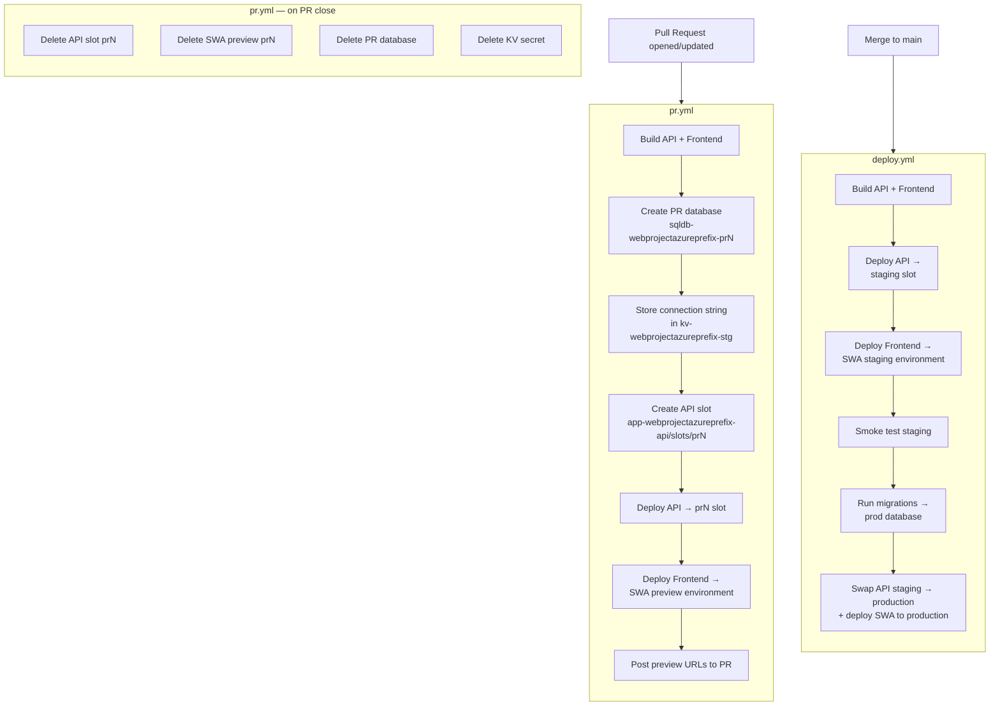

# WebProject Infrastructure

Azure infrastructure for WebProject, defined entirely in Bicep at subscription scope. A single deployment creates and manages every Azure resource the application needs.

## Architecture overview

```
Subscription
└── rg-webprojectazureprefix  (resource group)
    ├── id-webprojectazureprefix               Managed identity (shared by all resources)
    ├── sql-webprojectazureprefix              SQL logical server
    │   ├── sqldb-webprojectazureprefix-prod   Production database
    │   └── sqldb-webprojectazureprefix-stg    Staging database
    ├── kv-webprojectazureprefix-prod-<suffix> Key Vault — production secrets only
    ├── kv-webprojectazureprefix-stg-<suffix>  Key Vault — staging + ephemeral PR secrets
    ├── stwebprojectazureprefix<suffix>        Storage account (uploads blob container)
    ├── appconfig-webprojectazureprefix        App Configuration (feature flags, shared config)
    ├── asp-webprojectazureprefix              App Service Plan (Standard S1+)
    │   └── app-webprojectazureprefix-api      .NET 10 API
    │       └── /slots/staging                 Staging slot
    └── swa-webprojectazureprefix              Static Web App (React SPA)
```

All resources carry `project: WebProject` and `managedBy: bicep` tags.

### Deployment flow



## File layout

```
infra/
  bicepconfig.json          Linter rules + experimental features (userDefinedFunctions)
  main.bicep                Entry point — subscription scope
  main.bicepparam           Default parameter values
  deploy.ps1                Deploy helper for Windows (PowerShell + az CLI)
  deploy.sh                 Deploy helper for Linux/macOS (bash + az CLI)
  modules/
    managed-identity.bicep
    sql-server.bicep
    sql-database.bicep      Reusable — called per database (prod, stg, ephemeral PR)
    keyvault.bicep          Reusable — instantiated twice (prod, stg)
    storage.bicep
    app-configuration.bicep
    app-service.bicep       API only — frontend is a separate Static Web App
    static-web-app.bicep    React SPA (Free tier, PR previews built-in)

config/
  appconfig.yaml            Environment-specific application settings
  featureflags.yaml         Feature flag definitions (bootstrap-only)
  sync-appconfig.sh         Syncs YAML config to Azure App Configuration
```

## Environments

The API uses a **slot-based** model on App Service. The frontend is an **Azure Static Web App**, which has PR preview environments built in.

| Environment | API | Frontend | SQL database | Key Vault |
|---|---|---|---|---|
| Production | `app-webprojectazureprefix-api` (production slot) | `swa-webprojectazureprefix` (production) | `sqldb-webprojectazureprefix-prod` | `kv-webprojectazureprefix-prod-<suffix>` |
| Staging | `app-webprojectazureprefix-api/slots/staging` | `swa-webprojectazureprefix` (staging environment) | `sqldb-webprojectazureprefix-stg` | `kv-webprojectazureprefix-stg-<suffix>` |
| Ephemeral PR | Additional slot (`prN`) created by CI/CD | `swa-webprojectazureprefix` PR preview (automatic) | New database per PR | `kv-webprojectazureprefix-stg-<suffix>` (same) |

PR environments deploy both the API slot and the SWA preview in a coordinated workflow so they stay in sync. The SWA preview URL and the API PR slot URL are both posted as a PR comment. Ephemeral PR environments use the **staging Key Vault** — production secrets never reach them.

## Secret isolation

Two Key Vaults are deployed to enforce a hard boundary between production and all other environments:

```bicep
// main.bicep — prod vault points at the prod database
module kvProd 'modules/keyvault.bicep' = {
  params: {
    name: 'kv-${prefix}-prod-${uniqueSuffix}'
    sqlConnectionString: 'Server=tcp:${sqlServer.outputs.serverFqdn},1433;Initial Catalog=${sqlDbProd.outputs.databaseName};...'
  }
}

// Staging vault points at the staging database
module kvStg 'modules/keyvault.bicep' = {
  params: {
    name: 'kv-${prefix}-stg-${uniqueSuffix}'
    sqlConnectionString: 'Server=tcp:${sqlServer.outputs.serverFqdn},1433;Initial Catalog=${sqlDbStg.outputs.databaseName};...'
  }
}
```

The Key Vault name is injected into each App Service slot as a [Key Vault reference](https://learn.microsoft.com/azure/app-service/app-service-key-vault-references):

```bicep
// modules/app-service.bicep
func kvRef(vaultName string, secretName string) string =>
  '@Microsoft.KeyVault(VaultName=${vaultName};SecretName=${secretName})'

// Production slot gets prodKeyVaultName
{ name: 'ConnectionStrings__DefaultConnection', value: kvRef(prodKeyVaultName, 'sql-connection-string') }

// Staging slot gets stagingKeyVaultName
{ name: 'ConnectionStrings__DefaultConnection', value: kvRef(stagingKeyVaultName, 'sql-connection-string') }
```

At runtime, App Service resolves the `@Microsoft.KeyVault(...)` string to the actual secret value using the managed identity — no secrets ever appear in plain text in app settings.

## Slot-sticky settings

When a deployment slot is swapped into production, Azure swaps **all** app settings by default. That would cause the production slot to inherit the staging database connection string — exactly what we want to prevent.

`slotConfigNames` marks specific settings as **sticky**: they stay with the slot they were assigned to and do not travel on a swap.

```bicep
var stickyApiSettingNames = [
  'ASPNETCORE_ENVIRONMENT'
  'ConnectionStrings__DefaultConnection'
  'AppConfiguration__Endpoint'
]
```

After a swap:
- The production slot keeps `ASPNETCORE_ENVIRONMENT=Production` and its prod Key Vault reference.
- The staging slot keeps `ASPNETCORE_ENVIRONMENT=Staging` and its staging Key Vault reference.
- The swapped **code** (binaries, build output) moves between slots normally.

## Authentication — managed identity

A single user-assigned managed identity (`id-webprojectazureprefix`) is attached to every App Service slot. Resources grant it access via RBAC rather than connection strings or API keys:

| Resource | Role granted |
|---|---|
| `kv-webprojectazureprefix-prod` | Key Vault Secrets User |
| `kv-webprojectazureprefix-stg` | Key Vault Secrets User |
| `appconfig-webprojectazureprefix` | App Configuration Data Reader |
| Storage account | Storage Blob Data Contributor |

The identity's client ID is provided to the app as `AZURE_CLIENT_ID`. The Azure SDK picks this up automatically via `DefaultAzureCredential`.

## Deploying

### Prerequisites

- [Azure CLI](https://learn.microsoft.com/cli/azure/install-azure-cli) with Bicep extension
  `az bicep install`
- Logged in with sufficient access to create a resource group at subscription scope
  `az login`

### Initial deployment

**Windows (PowerShell):**
```powershell
./infra/deploy.ps1
```

**Linux/macOS (bash):**
```bash
./infra/deploy.sh
```

Both scripts prompt for the SQL admin password interactively. They compile `main.bicep` to ARM JSON, then create/update the `stack-webprojectazureprefix` deployment stack at subscription scope.

#### What-if (dry run)

```powershell
./infra/deploy.ps1 -WhatIf
```
```bash
./infra/deploy.sh --what-if
```

#### Override location

```powershell
./infra/deploy.ps1 -Location eastus2
```
```bash
./infra/deploy.sh --location eastus2
```

### Idempotency

All resources use deterministic names (`webprojectazureprefix` prefix + optional `uniqueString` suffix for globally-unique resources). Re-running the deployment is safe — Bicep performs incremental updates and only changes what has drifted.

## CI/CD

This project follows trunk-based development: all changes merge to `main`, every merge deploys automatically to staging, and promotion to production is a slot swap after smoke tests pass. Pull requests get their own throwaway environment spun up for review.

### Authentication — federated identity (OIDC)

GitHub Actions authenticates to Azure using **federated credentials** on the managed identity. No client secret or certificate is stored anywhere — GitHub exchanges a short-lived OIDC token for an Azure access token at job startup.

**One-time setup** (run once after the initial deployment):

```bash
# Get the object ID of the managed identity
IDENTITY_ID=$(az identity show \
  --resource-group rg-webprojectazureprefix \
  --name id-webprojectazureprefix \
  --query principalId -o tsv)

# Add a federated credential for the main branch (staging deploys)
az identity federated-credential create \
  --identity-name id-webprojectazureprefix \
  --resource-group rg-webprojectazureprefix \
  --name github-main \
  --issuer https://token.actions.githubusercontent.com \
  --subject repo:<org>/<repo>:ref:refs/heads/main \
  --audiences api://AzureADTokenExchange

# Add a federated credential for pull requests (ephemeral environments)
az identity federated-credential create \
  --identity-name id-webprojectazureprefix \
  --resource-group rg-webprojectazureprefix \
  --name github-prs \
  --issuer https://token.actions.githubusercontent.com \
  --subject repo:<org>/<repo>:pull_request \
  --audiences api://AzureADTokenExchange
```

The managed identity needs **Contributor** on `rg-webprojectazureprefix` so pipelines can create/delete slots and databases.

**GitHub Actions secrets** (set in repository Settings → Secrets):

| Secret | Value |
|---|---|
| `AZURE_CLIENT_ID` | Client ID of `id-webprojectazureprefix` |
| `AZURE_TENANT_ID` | Your Azure tenant ID |
| `AZURE_SUBSCRIPTION_ID` | Your subscription ID |

### Workflow overview

```
PR opened / updated
  └─► pr.yml
        ├─ build API + frontend (VITE_API_BASE_URL baked in for the PR slot URL)
        ├─ create PR database, derive connection string from staging KV secret
        ├─ create API slot (prN), assign managed identity, set app settings
        ├─ run migrations against PR database
        ├─ deploy API build to prN slot
        ├─ deploy frontend build to SWA (auto-generates preview URL)
        ├─ set CORS allowed origin on PR slot
        └─ post both URLs as PR comment (updates existing comment on re-runs)

PR merged / closed
  └─► pr.yml (teardown)
        ├─ delete API slot prN
        ├─ close SWA PR preview environment
        ├─ delete PR database
        └─ delete PR connection string secret from staging KV

Commit pushed to main
  └─► deploy.yml
        ├─ build & test API + frontend (two frontend builds: staging + prod URLs)
        ├─ publish migration service binary
        ├─ deploy API to staging slot
        ├─ deploy frontend to SWA staging environment
        ├─ set CORS allowed origin on staging slot
        ├─ smoke test staging API (12 attempts, 10 s apart)
        ├─ run migrations against production database (from KV connection string)
        ├─ swap API staging → production
        └─ deploy frontend to SWA production
```

### What each pipeline can and cannot do

| Action | deploy.yml | pr.yml |
|---|---|---|
| Deploy to staging slot | ✅ | — |
| Swap staging → production | ✅ | ❌ never |
| Create/delete PR slots | — | ✅ |
| Create/delete PR databases | — | ✅ |
| Modify `main.bicep` infrastructure | ❌ manual only | ❌ manual only |

Infrastructure changes (adding resources, changing SKUs, etc.) always go through `deploy.ps1` / `deploy.sh` manually. CI/CD only deploys application code and manages the per-PR lifecycle.

## Linter and compiled artefacts

`bicepconfig.json` enables strict linter rules and the `userDefinedFunctions` experimental feature (used by `func kvRef()` in `app-service.bicep`).

Compiled ARM JSON (`infra/**/*.json`) is gitignored — never commit generated files. The Bicep source is the source of truth.
